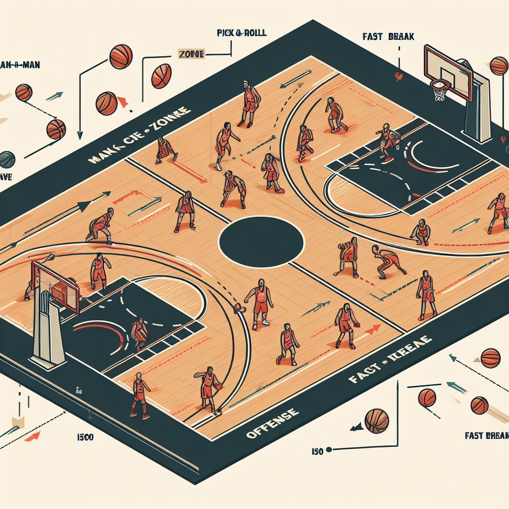
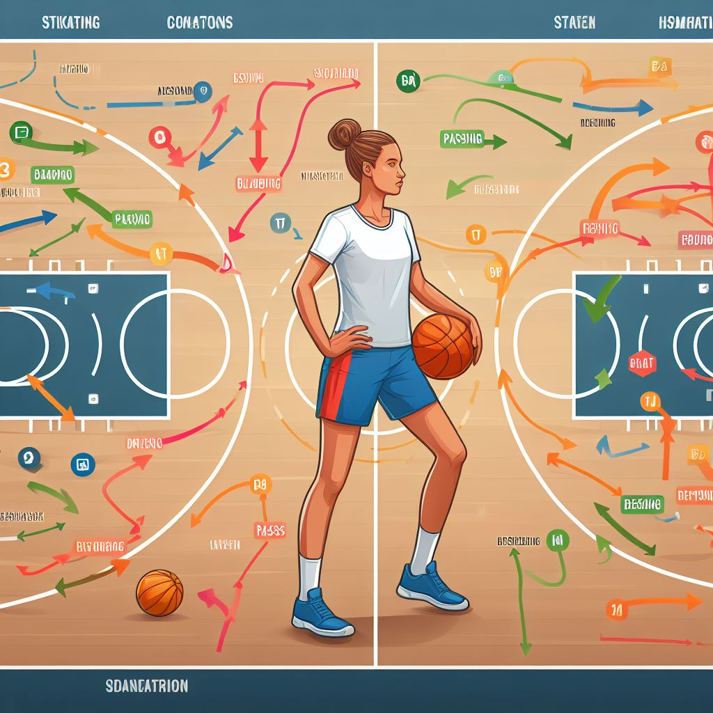
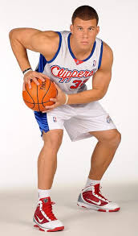
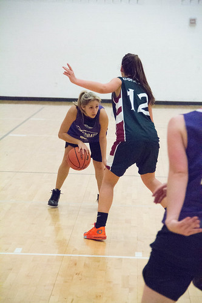
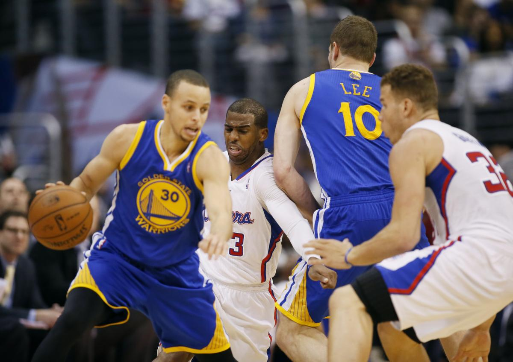

<!--
author: Jan Mueller

email:  SmFuLk11ZWxsZXI0QHNjaHVsZS5oZXNzZW4uZGU= (base64;-)

version:  0.1.0

language: Deutsch

narrator: Deutsch Female

comment:  Bei der Erstellung dieser Arbeitsmaterialien wurde Bing-Chat verwendet. Als Initial-Prompts wurden meist die im Text befindlichen Überschriften in Frageform verwendet. 

link:     https://cdn.jsdelivr.net/chartist.js/latest/chartist.min.css

script:   https://cdn.jsdelivr.net/chartist.js/latest/chartist.min.js
-->

# Basketball - Taktik

# Individualtaktiken im Basketball

Individualtaktiken im Basketball sind die gezielten Maßnahmen, die ein Spieler anwendet, um einen Vorteil oder einen Nachteil gegenüber seinem Gegner zu erlangen. Es gibt verschiedene Arten von Individualtaktiken, die je nach Situation und Position des Spielers angewendet werden können. In diesem Artikel werden einige Beispiele für Individualtaktiken im Angriff und in der Verteidigung vorgestellt.

## Individualtaktiken im Angriff

Individualtaktiken im Basketball im Angriff sind die gezielten Maßnahmen, die ein Spieler anwendet, um einen Vorteil gegenüber seinem Gegner zu erlangen und einen erfolgreichen Abschluss zu erzielen. Es gibt verschiedene Arten von Individualtaktiken, die je nach Situation und Position des Spielers angewendet werden können. Einige Beispiele sind:

- **Schrittfinten:** Das sind Täuschungsschritte, die der Angreifer ausführt, um den Verteidiger zu verwirren und an ihm vorbeizuziehen. Es gibt verschiedene Arten von Schrittfinten, wie z.B. Jab Step, Jab & Go, Cross-Over-Step, Rocker Step und Rocker & Go[^1].
- **Dribbelfinten:** Das sind Handwechsel oder Geschwindigkeitsänderungen, die der Angreifer während des Dribbelns macht, um den Verteidiger auszuspielen oder abzuschütteln. Es gibt verschiedene Arten von Dribbelfinten, wie z.B. Hesitation, Crossover, Behind-the-Back, Between-the-Legs und Spin Move[^1].
- **Lauffinten:** Diese werden vom Angreifer ohne Ball ausgeführt. Sie dienen vor allem dazu sich vom direkten Gegenspieler abzusetzen und in Ballbesitz zu kommen[^2]. Beispiele sind der I-Cut, V-Cut und L-Cut.
- **Passfinten:** Unter Passfinden versteht man das Antäuschen eines Passes in einen bestimmte Richtung und das Spielen des Pases in einen andere Richtung. Ein sehr bekanntes Beispiel ist der no-look-pass[^2].
- **Wurffinten:** Eine Wurffinte wird angewendet, um den Verteidiger aus seiner stabilen Position herauszubringen. Z.b. durch einen Blick zum Korb und das Über-den-Kopf-nehmen des Balles wird eine Korpwurf fintiert. Reagiert der Verteidiger daruf wird er sich strecken oder sogar springen, sodass der Verteidiger evtl. an ihm Vorbeidribbeln kann[^2].

[^1]: 1-1 Angreiferschulung – 3 – Basketball Co@ches Corner. https://www.bbcoach.de/wp/1-1-angreiferschulung-3/.
[^2]: Das Spiel mit dem Roten Ball - Adolph&Becker - Kapitel 5.1.1.3

---
**Weitere Quellen**

- [Individuelles Angriffspiel - DHB Trainer Center.](https://www.dhb-trainercenter.de/dhb-rahmentrainingskonzeption/grundlagentraining/individuelles-angriffspiel/?L=0.)
- [Basketball-Taktik: Gezielte Strategien zu Angriff & Verteidigung.](https://www.owayo.de/magazin/basketballtaktik-gezielte-strategien-angriff-und-verteidigung-basketball-de.htm.)
- [Der Angriff im Basketball - VIBSS.](https://vibss.de/fileadmin/Medienablage/Sportpraxis/PH_Basketball/PH_Basketball_-_Angriff.pdf.)

### Individuelle Grundstellung im Angriff

Die Basketballgrundstellung Tuck-Stellung, das Facing und die SPD-Position sind wichtige Elemente der Individualtaktik im Angriff. Sie ermöglichen es dem Spieler, flexibel und schnell auf die Spielsituation zu reagieren und eine der drei Optionen Schießen, Passen oder Dribbeln auszuführen. Die Begriffe bedeuten:

- **Tuck-Stellung**: Die Tuck-Stellung ist eine Körperhaltung, bei der der Spieler den Ball mit beiden Händen fest umfasst und ihn etwas seitlich am Körper auf Hüfthöhe hält. Damit schützt er den Ball vor dem Verteidiger und ist bereit, ihn zu passen oder zu dribbeln[^3].
- **Facing**: Das Facing ist die Ausrichtung des Spielers zum Korb. Der Spieler sollte immer mit dem Gesicht zum Korb stehen, um die Wurfmöglichkeiten zu erkennen und den Blickkontakt mit den Mitspielern zu halten[^4].
- **SPD-Position**: Die SPD-Position (Schießen, Passen, Dribbeln) ist die Grundstellung eines Spielers in Ballbesitz. Sie wird auch als Triple-Threat-Position oder Dreifach-Bedrohung bezeichnet, da der Spieler drei Optionen hat, die er ausführen kann. Die SPD-Position ist durch die folgende Körperhaltung gekennzeichnet[^5]:
  
  - parallele Fußstellung
  - Gewicht auf den Fußballen
  - Gleichgewicht
  - gebeugte Knie
  - aufrechter Oberkörper
  - Kopf hoch, Blick zum Korb
  - Ball mit beiden Händen fest umpackt
  - Geschütze Ballhaltung auf Hüfthöhe

Die SPD-Position ist die Basketballgrundstellung, die aus dem Ein-Kontakt-Stopp oder dem Tuck-Stopp erreicht werden kann. Sie ermöglicht es dem Spieler, explosiv anzutreten, einen Schuss zu nehmen oder einen Pass zu spielen[^3].

[^3]: Einführung der SPD-Position – Basketball Co@ches Corner. https://www.bbcoach.de/wp/einfuhrung-der-spd-position/.
[^4]: Fangen und Passen, Spielformen – Basketball Co@ches Corner. https://www.bbcoach.de/wp/fangen-und-passen-spielformen/.
[^5] SPD-Stellung – Wikipedia. https://de.wikipedia.org/wiki/SPD-Stellung.

## Individualtaktiken in der Verteidigung

Individualtaktiken im Basketball in der Verteidigung sind die gezielten Maßnahmen, die ein Spieler anwendet, um einen Nachteil gegenüber seinem Gegner zu vermeiden und einen erfolgreichen Ballgewinn zu erzielen. Es gibt verschiedene Arten von Individualtaktiken, die je nach Situation und Position des Spielers angewendet werden können. Einige Beispiele sind:

- **Beinarbeit:** Das ist die Fähigkeit, sich schnell und geschickt mit den Füßen zu bewegen, um den Angreifer zu verfolgen, abzudrängen oder zu blocken. Es gibt verschiedene Arten von Beinarbeit, wie z.B. Push Step, Swing Step, Release Step und Slide Step[^6].
- **Armarbeit:** Das ist die Fähigkeit, die Arme aktiv und gezielt einzusetzen, um den Angreifer zu stören, zu behindern oder den Ball abzunehmen. Es gibt verschiedene Arten von Armarbeit, wie z.B. Hand in the Face, Hand Check, Hand Denial und Hand Steal[^6].
- **Körperhaltung:** Das ist die Fähigkeit, eine optimale Position und Balance zu halten, um den Angreifer zu kontrollieren und zu reagieren. Eine gute Körperhaltung beinhaltet eine leichte Vorlage des Oberkörpers, eine tiefe Hüftstellung, eine breite Beinstellung und einen Blick auf den Ball[^6].
- **Antizipation:** Das ist die Fähigkeit, die Absichten und Bewegungen des Angreifers vorherzusehen und entsprechend zu handeln. Eine gute Antizipation erfordert eine hohe Konzentration, eine gute Beobachtung und eine schnelle Entscheidung[^7].

[^6]: Basketball-Taktik: Gezielte Strategien zu Angriff & Verteidigung. https://www.owayo.de/magazin/basketballtaktik-gezielte-strategien-angriff-und-verteidigung-basketball-de.htm.
[^7]: Basketball in der Schule: Die Verteidigung » mobilesport.ch. https://www.mobilesport.ch/basketball/basketball-in-der-schule-die-verteidigung/.

---
**Weitere Quellen**

- [1-1 Angreiferschulung – 3 – Basketball Co\@ches Corner.](https://www.bbcoach.de/wp/1-1-angreiferschulung-3/.)
- [Basketballtraining.de » Die Individual-Verteidigung als Grundlage jeder ....](http://basketballtraining.de/die-individual-verteidigung-als-grundlage-jeder-verteidigungsstrategie/.)
- [Basketballtraining.de » Individual- und Gruppentaktik im Basketball ....](http://basketballtraining.de/78/.)

### Individuelle Grundstellung in der Verteidigung

Die Körperstellung in der Verteidigung im Basketball ist eine wichtige Grundlage, um den Angriff des Gegners zu stoppen oder den Ball zu erobern. Dabei geht es darum, die eigene Balance, Beweglichkeit und Reaktionsfähigkeit zu optimieren und den Gegner unter Druck zu setzen. Eine gute Körperstellung in der Verteidigung im Basketball ist durch die folgenden Merkmale gekennzeichnet[^8][^9]:

- Die Füße stehen parallel und schulterbreit auseinander. Damit hat der Spieler eine stabile Basis und kann schnell in alle Richtungen laufen oder springen.
- Die Knie sind leicht gebeugt und das Gewicht ist auf den Fußballen verteilt. Damit kann der Spieler explosiv starten, stoppen oder wechseln und seine Geschwindigkeit anpassen.
- Der Oberkörper ist aufrecht und der Kopf ist hoch. Damit hat der Spieler eine gute Sicht auf den Ball, den Gegenspieler und das Spielfeld und kann die Situation lesen und antizipieren.
- Die Arme sind seitlich vorne mit leicht gebeugten Ellbogen angehoben und die Handflächen zeigen nach oben. Damit kann der Spieler den Gegenspieler stören, Pässe abfangen oder Würfe blockieren.
- Die Verteidigungsposition sollte immer so sein, dass der Spieler sich zwischen dem Gegenspieler und dem Korb befindet. Damit kann er den Zugang zum Korb erschweren und den Winkel für einen Wurf verkleinern.
- 

Die Körperstellung in der Verteidigung im Basketball sollte immer an die Spielsituation angepasst werden. Zum Beispiel sollte der Spieler seinen Abstand zum Gegenspieler je nach dessen Stärken und Schwächen variieren. Wenn der Gegenspieler ein guter Distanzschütze ist, sollte der Spieler näher an ihm dran sein, um den Wurf zu erschweren. Wenn der Gegenspieler ein guter Penetrator ist, sollte der Spieler etwas mehr Abstand halten, um den Zug zum Korb zu verhindern[^8].

[^8]: Die Verteidigung im Basketball - VIBSS. https://vibss.de/fileadmin/Medienablage/Sportpraxis/PH_Basketball/PH_Basketball_-_Verteidigung.pdf.
[^9]: 14. Unterrichtseinheit: Verteidigung MMV (Mann-Mann-Verteidigung) - DBB. https://www.basketball-bund.de/wp-content/uploads/UE-14-Verteidigung-MMV-Mann-Mann-Verteidigung.pdf.

## Gruppentaktik im Angriff

Gruppentaktiken im Angriff beim Basketball sind die gezielten Strategien, die eine kleine Gruppe von Spielern anwendet, um sich einen Vorteil gegenüber der gegnerischen Verteidigung zu verschaffen. Dabei geht es darum, die eigenen technischen und körperlichen Fähigkeiten optimal zu nutzen und die Schwächen der Gegner auszunutzen. Einige mögliche Gruppentaktiken im Angriff beim Basketball sind:

- **Pick and Roll**: Ein Pick and Roll ist eine Gruppentaktik, die durch zwei Spieler ausgeführt wird. Dabei stellt ein Spieler (der Picker) seinem Mitspieler (dem Ballführer) einen Block, um ihn vom Verteidiger freizubekommen. Anschließend löst sich der Picker vom Block und läuft zum Korb (Roll). Der Ballführer kann dann entweder selbst werfen oder den Picker anspielen¹. Der Pick and Roll erfordert eine gute Abstimmung zwischen den beiden Spielern und eine schnelle Entscheidung des Ballführers[^10].
- **Give and Go**: Ein Give and Go ist eine weitere Gruppentaktik, die durch zwei Spieler ausgeführt wird. Dabei passt ein Spieler den Ball zu einem Mitspieler und läuft sich dann selbst frei (Give). Der Mitspieler passt den Ball zurück zum ursprünglichen Ballführer, der nun in einer guten Wurfposition ist (Go). Das Give and Go setzt voraus, dass der Spieler sich vom Gegner lösen und sich anbieten kann[^11].

[^10]: Basketball-Taktik: Gezielte Strategien zu Angriff & Verteidigung. https://www.owayo.de/magazin/basketballtaktik-gezielte-strategien-angriff-und-verteidigung-basketball-de.htm.
[^11]: Der Angriff im Basketball - VIBSS. https://vibss.de/fileadmin/Medienablage/Sportpraxis/PH_Basketball/PH_Basketball_-_Angriff.pdf.

---
**Weitere Quellen**

- [Gruppentaktik – eine zentrale Taktik im Basketball.](ttps://basketballtraining.de/gruppentaktik-eine-zentrale-taktik-im-basketball/.)

## Gruppentaktik in der Verteidigung

Gruppentaktiken in der Verteidigung im Basketball sind die gezielten Strategien, die eine kleine Gruppe von Spielern anwendet, um den Angriff des Gegners zu stoppen oder den Ball zu erobern. Dabei geht es darum, die eigenen technischen und körperlichen Fähigkeiten optimal zu nutzen und die Stärken des Gegners zu neutralisieren. Einige mögliche Gruppentaktiken in der Verteidigung im Basketball sind:

- **Zonenverteidigung**: Eine Zonenverteidigung ist eine Gruppentaktik, bei der die Spieler nicht einen bestimmten Gegenspieler, sondern einen bestimmten Raum auf dem Spielfeld verteidigen. Dabei teilen sich die Spieler das Spielfeld in verschiedene Zonen auf, die sie je nach Position und Situation übernehmen. Ziel einer Zonenverteidigung ist es, den Zugang zum Korb zu erschweren, Pässe abzufangen oder Würfe zu blockieren[^12].
- **Mann-gegen-Mann-Verteidigung**: Eine Mann-gegen-Mann-Verteidigung ist eine Gruppentaktik, bei der jeder Spieler einen bestimmten Gegenspieler direkt verteidigt. Dabei versucht der Verteidiger, den Angreifer am Ballbesitz, am Dribbling, am Passen oder am Werfen zu hindern. Ziel einer Mann-gegen-Mann-Verteidigung ist es, den Gegner unter Druck zu setzen, Fehler zu provozieren oder den Ball zu erobern[^12].
- **Mischformen**: Neben den reinen Varianten der Zonenverteidigung und der Mann-gegen-Mann-Verteidigung gibt es auch Mischformen, bei denen die Mehrheit der verteidigenden Spieler den Raum und einer oder zwei Spieler einen direkten Gegenspieler verteidigen. Die bekanntesten Mischformen sind die Box-and-One-, die Triangle-and-Two- und die Diamond-and-One-Verteidigung. Ziel einer Mischform ist es, die gefährlichsten Angreifer des Gegners auszuschalten oder die gegnerische Angriffsstrategie zu stören[^13].

[^12]: Gruppentaktik – eine zentrale Taktik im Basketball. https://basketballtraining.de/gruppentaktik-eine-zentrale-taktik-im-basketball/.
[^13]: Basketball-Taktik: Gezielte Strategien zu Angriff & Verteidigung. https://www.owayo.de/magazin/basketballtaktik-gezielte-strategien-angriff-und-verteidigung-basketball-de.htm.

---
**Weiterer Quellen**

- [Basketball: Mischformen aus Zonenverteidigung und Mann-gegen-Mann ....](https://www.trainingsworld.com/training/taktiktraining/basketball-taktik-mischformen-zonenverteidigung-mann-gegen-mann-verteidigung-2503373.)
- [Basketball in der Schule: Die Verteidigung » mobilesport.ch.](https://www.mobilesport.ch/basketball/basketball-in-der-schule-die-verteidigung/.)
- [Basketball Übungen für verteidigen Verwendung in Ihrem Training?.](https://www.yoursportplanner.com/de/ubungen/basketball-de/verteidigen/.)