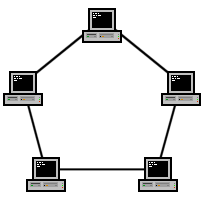
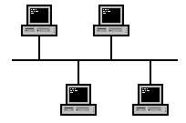
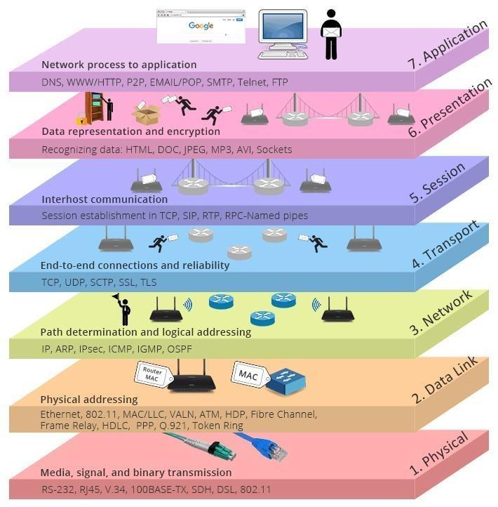
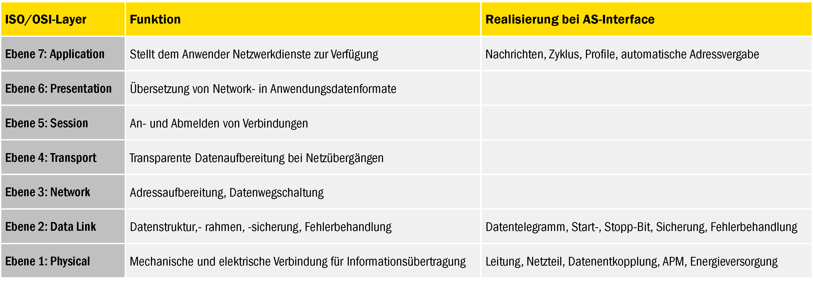
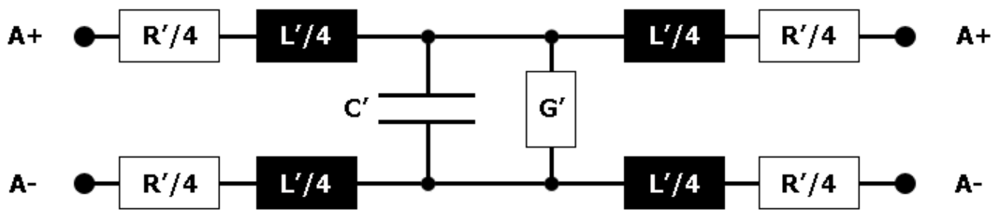
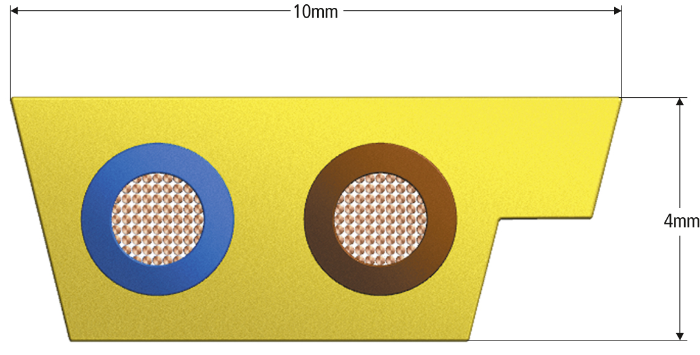
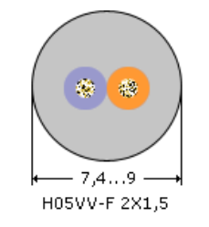
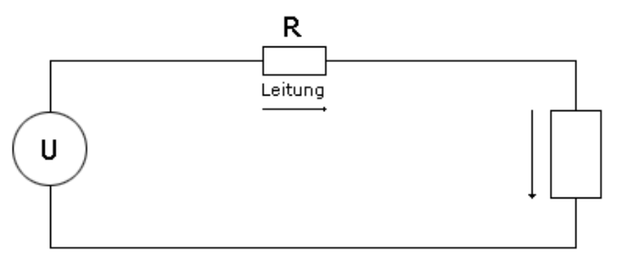
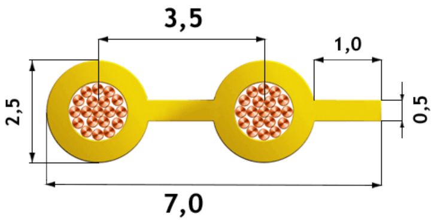
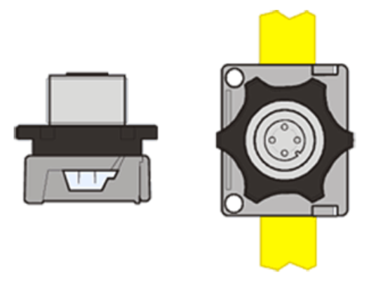

<!--
author:

email:    

version:  0.0.1

language: Deutsch

narrator: Deutsch Female

comment:  

link:     https://cdn.jsdelivr.net/chartist.js/latest/chartist.min.css

script:   https://cdn.jsdelivr.net/chartist.js/latest/chartist.min.js
-->
# Bussysteme

## Bussystemen in der Elektrotechnik

Bussysteme in der Elektrotechnik, auch bekannt als Binary Unit System, sind Datenübertragungssysteme, die zum standardisierten Verbinden dezentral angeordneter Geräte, der sogenannten Busteilnehmer, dienen[^4]. Sie ermöglichen den einheitlichen Austausch von Daten zwischen verschiedenen Teilnehmern bzw. Komponenten[^5]. 

Die übertragenen Daten dienen dem Melden und Steuern und anderen betriebstechnischen Funktionen[^4]. Bussysteme bilden die Voraussetzung für eine umfassende Gebäudeautomation[^4]. Sie sind vergleichbar mit dem menschlichen Blutkreislauf, der Nährstoffe zu den einzelnen Organen transportiert, und bringen Energie und Daten zu den einzelnen Komponenten des Netzwerks[^3].

Einige Beispiele für Bussysteme sind PROFIBUS, CAN, I2C und Ethernet[^1]. Diese Systeme müssen elektrisch und mechanisch sehr robust sein, um in einer rauen industriellen Umgebung zuverlässig zu funktionieren[^1]. 

Moderne Bussysteme zeichnen sich dadurch aus, dass nicht jeder Sensor eine eigene Leitung z.B. zu einer Zentralsteuereinheit hat, sondern dass nur eine einzige Leitung existiert, die durch alle Sensoren geführt wird[^1]. Die Informationen werden daher nicht mehr gleichzeitig auf parallelen laufenden Leitungen, sondern zeitversetzt seriell auf einer gemeinsamen Leitung übertragen[^1]. Dazu muss jeder Information eine Adresse zur Identifikation mitgegeben werden[^1].

[^1]: BUS-Technik - Heizung - Regelung - Baunetz_Wissen. https://www.baunetzwissen.de/heizung/fachwissen/regelung/bus-technik-161246.
[^2]: Was ist Bus (Elektrotechnik)? Binary Unit System - schnell erklärt. https://heinen-elektronik.de/glossar/bus/.
[^3]: Industrielle Bussysteme – Funktionsweise und Anforderungen. https://industrie-wegweiser.de/bussysteme/.
[^4]: Was sind Bussysteme, Schnittstellen und Sensornetze? Erklärung .... https://www.industry-of-things.de/was-sind-bussysteme-schnittstellen-und-sensornetze-erklaerung-funktionsweise-und-ueberblick-a-683219/.
[^5]: Bussystem Grundprinzip - Aufbau Bussystem - Funktion Bussystem. https://dein-elektriker-info.de/grundprinzip-bussystem/.

### Vorteile

Bussysteme werden in der Elektrotechnik aus verschiedenen Gründen verwendet:

- **Automatisierung und Kontrolle**: Mithilfe von Bussystemen können verschiedene Prozesse und Geräte in Gebäuden miteinander vernetzt und zentral überwacht sowie gesteuert werden[^6]. 
- **Energieeffizienz und Kosteneinsparungen**: Die Bus-/Gebäudesystemtechnik kann dazu beitragen, den Energieverbrauch in Gebäuden zu reduzieren, indem sie die Beleuchtung, Heizung, Klimatisierung und Belüftung automatisch reguliert und an die Bedürfnisse der Nutzer und des Gebäudes anpasst[^1]. Die Reduzierung des Energieverbrauchs und die Optimierung der Wartung und Instandhaltung verringert zugleich die Kosten[^1].
- **Sicherheit**: Die Integration von Sicherheitskomponenten kann die Sicherheit von Gebäuden erhöhen und Schäden durch Einbrüche oder Brände verhindern[^1].
- **Flexibilität**: Durch die Möglichkeit, die Steuerung und Überwachung von Gebäuden zentral zu verwalten, kann die Bus-/Gebäudesystemtechnik eine hohe Flexibilität und Anpassungsfähigkeit bieten[^6].
- **Vereinfachte Installation und Wartung**: Im Gegensatz zur klassischen Elektroinstallation, bei der Steuerfunktion und Energieverteilung fest verbunden sind, trennt das Bussystem die Steuerung der Geräte und die Stromversorgung[^2]. Dies führt zu Kostensenkungen in Bezug auf Material und Arbeitsaufwand[^5].
- **Datenaustausch**: Ein Bus (Binary Unit System) stellt die Verbindung zwischen verschiedenen Teilnehmern bzw. Komponenten her und ermöglicht somit den einheitlichen Austausch von Daten[^7].

[^6]: Grundprinzip von Bussystemen - Elektro - Baunetz Wissen. https://www.baunetzwissen.de/elektro/fachwissen/gebaeudesystemtechnik/grundprinzip-von-bussystemen-153070.
[^7]: Anwendung von Bussystemen und Protokollen. https://www.kunbus.de/anwendung-von-bussystemen-und-protokollen.

### Nachteile

Bussysteme haben einige Nachteile, die berücksichtigt werden sollten:

- **Komplexität**: Bussysteme können komplex sein und erfordern spezielle Kenntnisse und Fähigkeiten für Installation und Wartung.
- **Kosten**: Die Anschaffungs- und Installationskosten können höher sein als bei herkömmlichen Verkabelungssystemen.
- **Leistung**: Bei hohem Datenverkehr können Bussysteme langsamer werden, da alle Daten über einen einzigen Bus gesendet werden.
- **Fehleranfälligkeit**: Wenn ein Problem auf dem Bus auftritt, kann dies Auswirkungen auf das gesamte Netzwerk haben.
- **Skalierbarkeit**: Bussysteme können Schwierigkeiten haben, mit dem Wachstum des Netzwerks Schritt zu halten, insbesondere wenn die Anzahl der Geräte zunimmt.

Es ist wichtig, diese Faktoren zu berücksichtigen, wenn man über die Implementierung eines Bussystems nachdenkt.
### 1. Quiz 

**1. Was wird unter dem Begriff Bussystem in der Elektrotechnik verstanden?**

[[___ ___ ___ ___]]

**2. Ordne die folgenden Begriffe jeweils als Vor- oder Nachteil eines Bussystems zu!**

<!--
    data-randomize 
    data-solution-button="off" 
-->
- [ [Vorteil]   [Nachteil] ]
- [ [x]         [ ]        ]   Automatisierung und Kontrolle
- [ [x]         [ ]        ]   Energieeffizienz und Kosteneinsparungen
- [ [x]         [ ]        ]   Sicherheit
- [ [x]         [ ]        ]   Flexibilität
- [ [x]         [ ]        ]   Vereinfachte Installation und Wartung
- [ [x]         [ ]        ]   Datenaustausch
- [ [ ]         [x]        ]   Komplexität
- [ [ ]         [x]        ]   Kosten
- [ [ ]         [x]        ]   Fehleranfälligkeit
- [ [ ]         [x]        ]   Skalierbarkeit
## Netzwerktopologien

Es gibt verschiedene Arten von Netzwerktopologien, die in Eingesetzt verwendet werden können:

**Stern-Topologie (Star Topology)**: In dieser Topologie ist jeder Knoten (z.B. Computer, Drucker) über eine separate Verbindung direkt mit einem zentralen Netzwerkknoten verbunden. Der zentrale Netzwerkknoten könnte ein Netzwerk-Switch, Hub oder Router sein.

**Ring-Topologie (Ring Topology)**: In einer Ring-Topologie sind alle Knoten in Form eines geschlossenen Schleifenrings miteinander verbunden. Jeder Knoten ist genau mit zwei anderen Knoten verbunden.

**Bus-Topologie (Bus Topology)**: Bei einer Bus-Topologie sind alle Knoten entlang einer einzigen Kabelstrecke, dem sogenannten "Backbone", verbunden. 

**Baum-Topologie (Tree Topology)**: Eine Baum-Topologie ist eine Erweiterung der Stern-Topologie. In der Baum-Topologie sind mehrere Stern-Topologien auf einem zentralen Bus aufgebaut.

**Maschen-Topologie (Mesh Topology)**: In einer Maschen-Topologie ist jeder Knoten mit vielen (in einigen Fällen mit allen) anderen Knoten verbunden. 

Jede Topologie hat ihre spezifischen Einsatzmöglichkeiten und Vorteile. Die Wahl der Bustopologie hängt von den spezifischen Anforderungen des Netzwerks ab.

### 2. Quiz

**1. Wie unterscheiden sich die einzelenen Netzwerktopologien untereinander?**

[[___ ___ ___ ___]]

**2. Weisen Sie den jeweiligen Beschreibungen die passende Neztwektopologie zu!**

<!--
    data-randomize 
    data-solution-button="off" 
-->
| Topologie | Beschreibung |
|-----------|--------------|
| [[Stern | Ring | (Bus) | Baum | Masche]] | In dieser Topologie sind alle Knoten entlang einer einzigen Kabelstrecke, dem sogenannten "Backbone", verbunden. |
| [[Stern | Ring | Bus | Baum | (Masche)]] | In dieser Topologie ist jeder Knoten mit vielen (in einigen Fällen mit allen) anderen Knoten verbunden. |
| [[(Stern) | Ring | Bus | Baum | Masche]] | In dieser Topologie ist jeder Knoten über eine separate Verbindung direkt mit einem zentralen Netzwerkknoten verbunden. |
| [[Stern | Ring | Bus | (Baum) | Masche]] | In dieser Topologie sind mehrere Stern-Topologien auf einem zentralen Bus aufgebaut. |
| [[Stern | (Ring) | Bus | Baum | Masche]] | In dieser Topologie sind alle Knoten in Form einer geschlossenen Schleife miteinander verbunden. |

## OSI-Schichten Modell

Das OSI-Modell (Open Systems Interconnection) ist ein Referenzmodell für Netzwerkprotokolle[^8]. Es wurde von der International Organization for Standardization (ISO) entwickelt, um die standardisierte Kommunikation zwischen verschiedenen Computersystemen zu ermöglichen[^9]. Das Modell besteht aus sieben Schichten[^10]:

1. **Physical Layer (Bitübertragungsschicht)**: Diese Schicht ist für die physikalische Übertragung von Daten zuständig.
2. **Data Link Layer (Sicherungsschicht)**: Diese Schicht stellt eine fehlerfreie Verbindung zwischen den Netzwerkknoten her und kontrolliert den Datenfluss.
3. **Network Layer (Vermittlungsschicht)**: Diese Schicht ist für die Wegewahl (Routing) und die Vermittlung von Datenpaketen zuständig.
4. **Transport Layer (Transportschicht)**: Diese Schicht stellt eine zuverlässige Ende-zu-Ende-Verbindung her und sorgt für die korrekte Reihenfolge der Datenpakete.
5. **Session Layer (Sitzungsschicht)**: Diese Schicht ermöglicht den Aufbau, die Steuerung und den Abbau von Sitzungen zwischen Anwendungsprozessen.
6. **Presentation Layer (Darstellungsschicht)**: Diese Schicht ist für die Darstellung der Daten verantwortlich und sorgt dafür, dass die Daten so umgewandelt werden, dass sie von der Anwendungsschicht verstanden werden können.
7. **Application Layer (Anwendungsschicht)**: Diese Schicht stellt Funktionen für Anwendungen bereit und ermöglicht den Zugriff auf Netzwerkdienste.

Jede Schicht erfüllt dabei eine bestimmte Aufgabe und kommuniziert mit den Schichten direkt über und unter ihr. Die Schichten können miteinander kommunizieren und Daten unter sich austauschen. Bei der Kommunikation zwischen zwei Systemen werden alle sieben Schichten mindestens zwei Mal angewendet: jeweils einmal beim Sender und einmal beim Empfänger[^11]. 

Das OSI-Modell ist kein konkreter Netzwerkstandard, sondern beschreibt in abstrakter Form, welche Vorgänge geregelt werden müssen, damit die Kommunikation über ein Netzwerk funktioniert. Es bietet als konzeptioneller Rahmen eine Design-Grundlage für herstellerunabhängige Kommunikationsstandards[^9].

[^8]: OSI-Modell - Wikiwand. https://www.wikiwand.com/de/OSI-Modell.
[^9]: OSI Modell • 7 Schichten Modell, Erklärung, Anwendung. https://studyflix.de/informatik/osi-modell-5524.
[^10]: Das Osi Schichtenmodell: Einfach und verständlich erklärt!. https://praxistipps.chip.de/das-osi-schichtenmodell-einfach-und-verstaendlich-erklaert_160368.
[^11]: Grundlagen OSI-Modell einfach erklärt - simpleclub. https://simpleclub.com/lessons/fachinformatikerin-grundlagen-osi-modell.

### 3. Quiz

**1. Welchem Zweck dient das OSI-Schichtenmodell?**

[[___ ___ ___ ___]]

**2. Ordnen Sie die OSI-Schichten chronologisch!**

<!--
    data-randomize 
    data-solution-button="off" 
-->
| Schichtnummer | Schichtname |
|---------------|-------------|
| 7 | [[(Anwendungschicht) | Bitübertragungsschicht | Darstellungsschicht | Sicherungsschicht | Sitzungsschicht | Transportschicht | Vermittlungsschicht]] |
| 6 | [[Anwendungschicht | Bitübertragungsschicht | (Darstellungsschicht) | Sicherungsschicht | Sitzungsschicht | Transportschicht | Vermittlungsschicht]] |
| 5 | [[Anwendungschicht | Bitübertragungsschicht | Darstellungsschicht | Sicherungsschicht | (Sitzungsschicht) | Transportschicht | Vermittlungsschicht]] |
| 4 | [[Anwendungschicht | Bitübertragungsschicht | Darstellungsschicht | Sicherungsschicht | Sitzungsschicht | (Transportschicht) | Vermittlungsschicht]] |
| 3 | [[Anwendungschicht | Bitübertragungsschicht | Darstellungsschicht | Sicherungsschicht | Sitzungsschicht | Transportschicht | (Vermittlungsschicht)]] |
| 2 | [[Anwendungschicht | Bitübertragungsschicht | Darstellungsschicht | (Sicherungsschicht) | Sitzungsschicht | Transportschicht | Vermittlungsschicht]] |
| 1 | [[Anwendungschicht | (Bitübertragungsschicht) | Darstellungsschicht | Sicherungsschicht | Sitzungsschicht | Transportschicht | Vermittlungsschicht]] |
## Feldbusse

Feldbussysteme sind Datennetzwerke auf der industriellen Feldebene[^12]. Sie sind ein Oberbegriff für verschiedene Bussysteme, die in der Automatisierung, Fertigungstechnik, Gebäudeautomation sowie im Bereich Automotive zum Einsatz kommen und Bestandteil nahezu jeder komplexen Maschine oder Anlage sind[^13]. 

In einem Feldbussystem sind alle Komponenten mit der Regel- oder Steuerebene verbunden[^13]. Sie werden in Maschinen und Anlagen eingesetzt, um Sensoren und Aktoren (Motor) miteinander und mit einem oder mehreren zentralen Leitrechnern (Industrie-PC, SPS) zu verbinden[^14].

Ein Feldbus ist ein Bussystem, das in einer Anlage Feldgeräte wie Messfühler (Sensoren) und Stellglieder (Aktoren) zur Kommunikation mit einem Automatisierungsgerät verbindet. Wenn mehrere Kommunikationsteilnehmer ihre Nachrichten über dieselbe Leitung senden, dann muss festgelegt sein, wer (Kennung) was (Messwert, Befehl) wann (Initiative) sagt. Hierfür gibt es normierte Protokolle[^15].

Die erste Generation der Feldbustechnik wurde in den 1980er Jahren entwickelt, um die bis dahin übliche Parallelverdrahtung binärer Signale sowie die analoge Signalübertragung durch digitale Übertragungstechnik zu ersetzen. Heute sind viele unterschiedliche Feldbussysteme mit unterschiedlichen Eigenschaften am Markt etabliert. Seit 1999 werden Feldbusse in der Norm IEC 61158 (Digital data communication for measurement and control – Fieldbus for use in industrial control systems) weltweit standardisiert[^15].

[^12]: Feldbus – Wikipedia. https://de.wikipedia.org/wiki/Feldbus.
[^13]: Feldbussysteme - NANOTEC. https://de.nanotec.com/knowledge-base-artikel/feldbussysteme/.
[^14]: Was ist ein Feldbus? Grundlagen schnell erklärt - Glossar. https://heinen-elektronik.de/glossar/feldbus/.
[^15]: CAN-Bus Aufbau und Funktion. http://www.antal.de/htm/can.htm.

## ASi Feldbus

Das Actuator-Sensor-Interface, kurz ASi, ist ein Feldbussystem, das heute in nahezu allen Industriezweigen anzutreffen ist. Es wird seit Anfang der 1990er eingesetzt, um induktive, kapazitive und opto-elektronische Sensoren effektiver in automatisierte Produktionsprozesse einzubinden[^16].

AS-Interface ist als offener Standard nach IEC 62026-2 genormt und vollständig im TIA Portal integriert[^17]. Es ermöglicht eine Verkabelung mit frei wählbarer Topologie und ersetzt die aufwendige, herkömmliche Parallelverdrahtung. Die Verkabelung kann an Steuerungssysteme mit unterschiedlichen Feldbussystemen (etwa EtherNet/IP, Profibus-DP, Profinet, EtherCat etc.) angebunden werden[^18].

Ein zweiadriges Flachkabel überträgt Daten und Energie, wodurch die aufwendige Parallelverdrahtung entfällt. Die ausgereifte AS-Interface Technologie bietet eine hohe Zuverlässigkeit, Störsicherheit und vielfältige Diagnosemöglichkeiten. Der modulare Aufbau und die flexible Anschlusstechnik sorgen für eine einfache Eingliederung in die Anlage[^18].

AS-Interface ist ein effektives, leistungsstarkes Bussystem, das die Sensoren und Aktoren in der untersten Feldebene mit der übergeordneten Steuerung verbindet[^16]. Es ist einfach zu implementieren, flexibel, preiswert und einfach erweiterbar. Sichere und nicht sichere Informationen können über das gleiche System verarbeitet werden. Es bietet zudem eine Reduzierung von Klemmstellen durch modularen und flexible Anschlusstechnik[^18].

[^16]: ASi Bus System im Überblick - ifm - ifm electronic. https://www.ifm.com/de/de/shared/technologien/as-interface/systemuberblick.
[^17]: AS-Interface Basiswissen – So funktioniert das Bussystem für die .... https://www.elektormagazine.de/articles/as-interface-basiswissen-so-funktioniert-das-bussystem-fur-die-industrieautomation.
[^18]: ASi Bus/AS-Interface - Tools & Diagnosegeräte - Indu-Sol. https://www.indu-sol.com/produkte/as-interface/diagnose/.

### Einordnung in das ISO/OSI-Referenzmodell[^19]

Wie alle Kommunikations-Systeme lässt sich auch AS-Interface in das ISO/OSI-Referenzmodell mit seinen 7 Ebenen einordnen.

Wie bei anderen Feldbussen auch, sind bei AS-Interface aber nur die Ebenen 1, 2 und 7 realisiert. Die anderen Ebenen entfallen wegen der einfachen Struktur des Netzes, weil die Teilnehmer ständig verbunden sind und weil die Übersetzung der Datenformate ggf. von der Ebene 7 mit übernommen wird.

ABER: Die Einordnung in das Referenzmodell bedeutet nicht, dass AS-Interface entsprechend den Vorgaben des ISO/OSI Referenzmodells spezifiziert ist!

So sind die Ebenen bei AS-Interface keineswegs rückwirkungsfrei aufeinander aufgebaut. Die Datensicherung in der Ebene 2 beispielsweise verwendet zahlreiche Eigenschaften der Ebene 1. Nur auf diese Weise ist es möglich, sehr effektiv eine ausgezeichnete Fehlererkennungsrate zu erzielen.

[^19]: https://www.as-interface-academy.net/mod/lesson/view.php?id=32&pageid=13

### Die physikalische Schicht[^20]
Zur physikalischen Schicht von AS-Interface gehören folgende Elemente:

- AS-Interface Leitung und Netzwerk
- AS-Interface Energieversorgung und Datenentkopplung
- Modulationsverfahren
- AS-Interface Repeater und andere Komponenten zur Netzverlängerung

AS-Interface Repeater und andere Komponenten zur Netzverlängerung gehören ebenfalls zur physikalischen Schicht, weil sie es erlauben, Netzwerke zu verlängern und Netz-Segmente galvanisch voneinander zu trennen. Diese Produkte werden Sie im Modul "weitere Netzkomponenten" noch ausführlich kennen lernen.

[^20]: https://www.as-interface-academy.net/mod/lesson/view.php?id=32&pageid=14 
#### Die AS-Interface Leitung[^21]
Für die AS-Interface Leitung wurde ein Leitungsmodell mit folgenden Grenzdaten spezifiziert.

**Grenzdaten:**

- $R' < 90 mΩ/m$
- $L' = 400...1300 nH/m$
- $C' < 80 pF/m$
- $G' < 5 µS/m$

Zusätzlich wurde der Wellenwiderstand $|Z|$ auf den Bereich von $70...140 Ω$ und die Gruppenlaufzeit auf $t‘ < 8,3ns/m$ eingeschränkt, um ungünstige Kombinationen von $R‘, L‘$ und $C‘$ auszuschließen.

Besonders geeignet für den Aufbau von AS-Interface Netzwerken ist natürlich das gelbe Zweileiter-Flachkabel. Es ist Basis der Elektromechanik von AS-Interface für die Schutzart IP67 und erlaubt den Einsatz der effizienten Durchdringungstechnik, auf die wir später noch näher eingehen werden. Die Leiter haben typischerweise einen Querschnitt von 1,5mm² oder 2,5mm².

Diese Daten werden aber auch von zahlreichen anderen standardisierten Leitungen erfüllt. Ein AS-Interface Netzwerk kann also mit sehr unterschiedlichen Leitungen aufgebaut werden, ein Beispiel ist die Starkstrom-Leitung H05VV-F2x1,5.

Auch mehradrige Kabel oder Stromschienen sind bereits erfolgreich für den Aufbau von AS-Interface Netzwerken verwendet worden. In Zweifelsfällen sollte jedoch in der Planungsphase ein Fachmann konsultiert werden.

**Für die Auswahl eines geeigneten Übertragungsmediums das für AS-Interface sind zwei elektrische Eigenschaften von Bedeutung:**

- Gleichstromwiderstand für die Energieübertragung
- Übertragungseigenschaften im Frequenzbereich, der für die Kommunikation verwendet wird

Der Gleichstromwiderstand ist ohne Bedeutung, solange der Gesamtstrom durch das AS-Interface Netzwerk kleiner ist als etwa 1A.

Da es technisch aber möglich ist, Ströme bis über 8A in das Netzwerk einzuspeisen, muss gegebenenfalls überprüft werden, ob der resultierende Spannungsfall nicht zu groß wird. Die Folge könnte sein, dass die Slaves am Ende der Leitung nicht ausreichend spannungsversorgt werden und angeschlossene Aktuatoren nicht mehr zuverlässig funktionieren.

**Praxistipp:**

**Bei einem Gesamtstrom größer 1A ist der Spannungsfall zu prüfen, damit die Spannungsversorgung aller Slaves gewährleistet ist und alle Aktuatoren zuverlässig funktionieren!**

Es klingt trivial, muss aber bedacht werden: Die AS-Interface Technologie kann das Ohmsche Gesetz nicht außer Kraft setzen!

[^21]: https://www.as-interface-academy.net/mod/lesson/view.php?id=32&pageid=15

##### Flachkabel für IP67 Umgebung

Die standardisierte Elektromechanik von AS-Interface rundet das System mit einer innovativen Installations- und Montagetechnik ab. Sie liefert einen wesentlichen Beitrag zur Kostensenkung.

Im Bild dargestellt ist das gelbe AS-Interface Flachkabel für die Installation im Feld. Dieses Kabel ist zum Markenzeichen von AS-Interface geworden.

Die verfügbaren Mantelwerkstoffe decken mit ihren mechanischen und chemischen Eigenschaften die Beständigkeitsanforderungen, wie sie in der industriellen Automatisierungstechnik vorkommen, weitestgehend ab.

Verfügbare Mantelwerkstoffe:

- EPR Gummimischung EM3 nach DIN VDE 0207 Teil 21
- TPE YM5 nach DIN VDE 0207 Teil 5
- PUR nach CENELEC HD 22, T 10
  
Das Kabel gibt es in der Mantelfarbe "verkehrsgelb" für das AS-Interface Netzwerk sowie in der Mantelfarbe "schwarz" für die Hilfsenergie, die für manche Feldgeräte separat zugeführt werden kann.

##### Doppelader für IP20 Umgebung

Als Ergänzung des AS-Interface Flachkabels wurde die hier gezeigte Doppelader für den Einsatz in IP20-Umgebungen (in Schaltschränken, Verteilerkästen und ähnlichen geschützten Umgebungen) eingeführt. Sie ist nicht für die Feldinstallation geeignet.

Sie hat einen Leiterquerschnitt von 2 x 0,8mm² und verfügt neben der farblichen auch über eine mechanische Kennung. Diese Doppelader ist optimiert für die Kontaktierung mittels Schneidklemm-Technik. Hierbei wird jede Ader in eine Art Gabel eingepresst, wobei die Aderisolation durchschnitten und ein sicherer Kontakt hergestellt wird.

Auch hier entfallen Arbeiten wie das Auftrennen, Abisolieren, Aderendhülse montieren, Anklemmen, Schirm auflegen. Die AS-Interface Doppelader ist – weil für geschützte IP20 Umgebung nur einfach isoliert und mit einem geringeren Leiterquerschnitt ausgestattet – beweglicher und leichter handhabbar als das gelbe Flachkabel.

##### Durchdringungstechnik

Das gelbe Kabel hat einen Leiterquerschnitt von 2 x 1,5mm² und verfügt über eine Codierleiste, so dass es nur seitenrichtig gepolt eingelegt und kontaktiert werden kann. Die Kontaktierung (Durchdringungstechnik) erfolgt durch Kontaktmesser oder -dorne, die den Kunststoff des Mantels und der Ader durchdringen und einen sicheren Kontakt herstellen. Auftrennen, Abisolieren, Aderendhülsen montieren, Anklemmen, Schirm auflegen: alles das entfällt. Auch eine Konfektionierung der Leitung ist nicht mehr notwendig, weil das Kabel an jeder gewünschten Stelle kontaktiert werden kann.

Für das Herstellen von Abzweigen, Stichleitungen usw., für das Befestigen des Flachkabels, für das Einführen des Flachkabels durch DIN-Verschraubungen in Gehäuse usw. gibt es eine Fülle von Zubehör. Hierfür sei auf die Produktdatenbank von AS-International verwiesen: http://www.as-interface.net/… (Stichwort: Zubehör und Anderes/Verbindungsmodule/Montageplatten). Auch zahlreiche Module und Feldgeräte können direkt an das gelbe Flachkabel angeschlossen werden.

**Schneidklemm-Technik**

Für das Herstellen von Abzweigen, Stichleitungen, Anschlüssen usw. gibt es ebenfalls zahlreiches Zubehör. Hierfür sei auf die Produktdatenbank von AS-International verwiesen: http://www.as-interface.net/… (Stichwort: Zubehör und Anderes/Verbindungsmodule/Montageplatten).

##### 4. Quiz

**1. Welche Eigenschaften hat das ASi-Kabel und was sollte in der Praxis beachtet werden?**

[[___ ___ ___ ___]]

**2. Welche Leitungen werden bei der Installation eines AS-Interface Netzwerkes verwendent?**

<!-- data-randomize 
     data-solution-button="off" -->
    [[x]] Flachkabel für IP67 Umgebung
    [[x]] Doppelader für IP20 Umgebung
    [[x]] Doppelader mit 2 x 0,8mm²
    [[x]] Flachkabel mit 2 x 1,5mm²
    [[ ]] Flachkabel für IP20 Umgebung
    [[ ]] Doppelader für IP67 Umgebung
    [[ ]] Doppelader mit 2 x 1,5mm²
    [[ ]] Flachkabel mit 2 x 0,8mm²

## Lernkarten

Um wichtige Inhalte zu festigen gehen Sie bitte folgende Lernkarten durch.

??[Mochi Karteikarten](https://app.mochi.cards/decks/67233147-73f4-462a-984f-207550c6f793/1ZXP7UTP/Get-Started)

