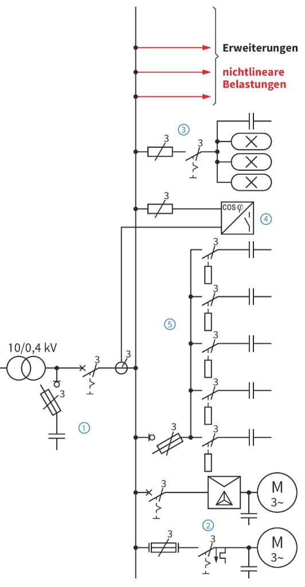
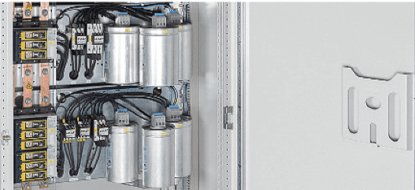
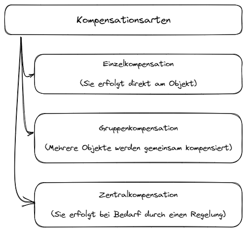
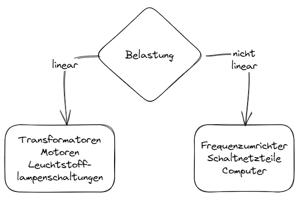
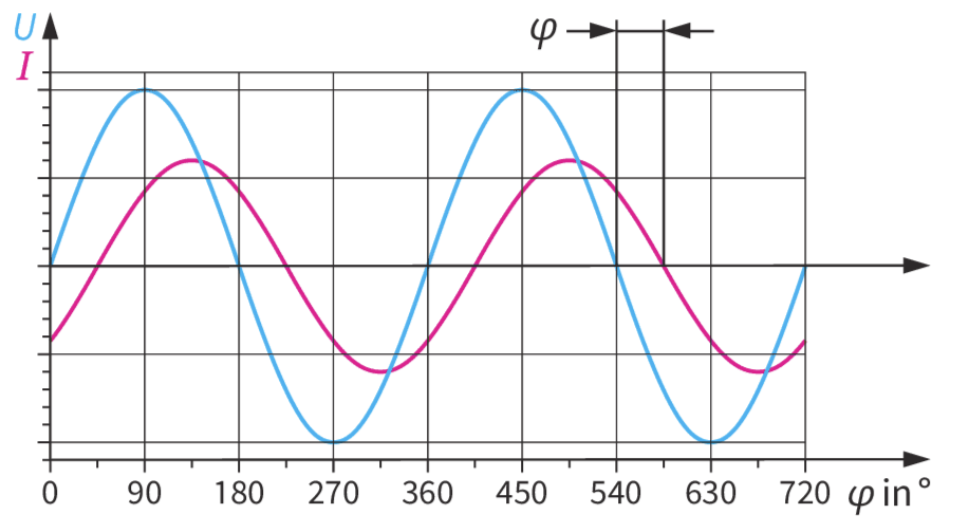
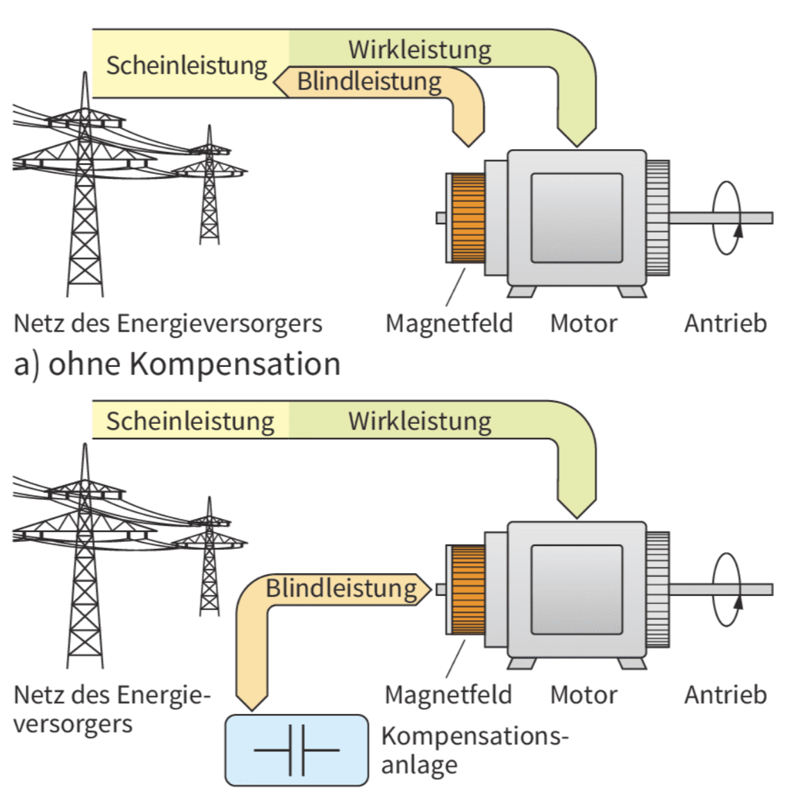
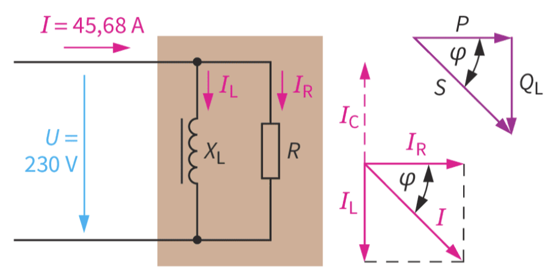
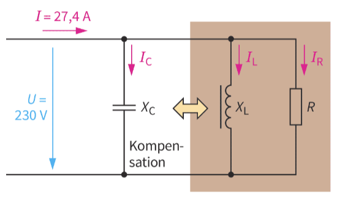

<!--
author:   

email:    

version:  0.0.1

language: Deutsch

narrator: Deutsch Female

comment:  

link:     https://cdn.jsdelivr.net/chartist.js/latest/chartist.min.css

script:   https://cdn.jsdelivr.net/chartist.js/latest/chartist.min.js

import:   https://raw.githubusercontent.com/liaScript/mermaid_template/master/README.md

translation: Deutsch  translations/German.md

translation: Français translations/French.md
-->

# Kompensationsanlagen

## Anlagenerweiterung

Die Anlage einer kleinen Maschinenfabrik soll durch zusätzliche Fertigungsplätze erweitert werden. 

Vorgesehen sind dafür einige geregelte Motoren mit Frequenzumrichtern. Diese nichtlinearen Belastungen erzeugen Oberschwingungen (harmonics), die im Netz Störungen verursachen. Damit eine gute Netzqualität auch weiterhin gewährleistet ist, müssen **Oberschwingungen** durch geeignete Schaltungen reduziert
(kompensiert) werden.

Die Elektroniker der Fa. Huber stellen vor Ort fest, dass die Energieversorgung mit den entsprechenden Schutzmaßnahmen für die neu zu installierenden Motoren mit den Frequenzumrichtern problemlos hergestellt werden kann.

Auch sind in der Anlage für die bereits vorhandenen linearen Belastungen (z. B. Induktivitäten in Motoren, Leuchtstofflampenschaltungen) Kompensationsschaltungen installiert. Verwendet werden dazu Kondensatoren. 

### Kompensationsarten

Die Kompensationsschaltungen sind unterschiedlich und werden als Einzel-, Gruppen- und Zentralkompensation bezeichnet.

Durch die vorzunehmenden Erweiterungen werden somit lineare und nichtlineare Belastungen gemeinsam in der Anlage vorkommen. Dieses muss bei der Installation berücksichtigen werden.

Folgend wird zunächst geklärt, was Kompensation bei induktiven und sinusförmigen Belastungen bedeutet und warum Kondensatoren dafür eingesetzt werden.

### Merke

> Lineare und nichtlineare Belastungen (Oberschwingungen) werden in der Regel durch geeignete Schaltungen kompensiert.

## Kompensationsprinzip

Bei induktiven Belastungen im Netz (z.B. Motoren, Transformatoren und Schweißmaschinen) kommt es zu einer **Phasenverschiebung** (Phasenverschiebungswinkel $\varphi$) zwischen der anliegenden Spannung $U$ und der Stromstärke $I$.

*Abb.: Phasenverschiebung bei induktiver Belastung*

Als Folge entsteht neben der Wirkleistung auch Blindleistung (z. B. beim Motor). Die vom Energieversorger gelieferte Scheinleistung ist somit größer als die tatsächlich benötigte Wirkleistung.

Mit einem Kondensator kann die Phasenverschiebung verringert bzw. ganz aufgehoben (kompensiert) werden, sodass die vom Energieversorger bereitgestellte Leistung der tatsächlich benötigten Wirkleistung entspricht.

Die zum Aufbaus des Magnetfeldes benötigte **Blindleistung** (reactive power) pendelt dann gewissermaßen zwischen der induktiven (Spule) und der kapazitiven Belastung (Kondensator) hin und her.

### Was bewirkt eine Blindleistungskompensation?

- Verringerung der Energiekosten (Blindleistung wird von den meisten VNBs ab einer bestimmten Höhe in Rechnung gestellt)
- Geringere Belastung der Objekte (z.B. Leitungen, Schaltgeräte)
- Verbesserung der Verluste auf Leitungen
- Erhöhung der Leistungsreserve
- Umweltschonender Energieeinsatz

### An welchen Objekten sollte Blindleistung kompensiert werden?

- Asynchronmotoren
- Stromrichter zur Kommutierung
- Transformatoren
- Schweißgeräte
- Leuchtstofflampen-Schaltungen mit VVGs, Entladungslampen mit Induktivitäten
- Drosselspulen

### Merke

> Induktive Blindleistungen lassen sich durch kapatzitive Blindleistungen kompensieren.

## Kompensationsbeispiel

In einer elektrischen Anlage mit Wirkwiderständen und induktiven Blindwiderständen werden folgende Größe ermittelt:

$$ 
\begin {align*}
U & = 230 V \\
I & = 45,68 A \\
cos \varphi & = 0,6 \\
f & = 50 Hz
\end {align*}
$$

Aus diesen Werten lassen sich die folgenden Leistungen berechnen:

$$ \begin{align*}
S &= U \cdot I  &= 230 V \cdot 45,68 A &= 10,5 kVA \\
P &= S \cdot cos\varphi &= 10,5 kVA \cdot 0,6 &= 6,3 kW \\
Q_L &= S \cdot sin\varphi &= 10,5 kVA \cdot 0,8 &= 8,4kvar
\end{align*} $$

Nutzbringend ist nur die **Wirkleistung** (active power) von $6,3 kW$. Die Blindleistung von $Q_L$ ist unerwünscht. Wenn nun die Wirkwiderstände in der Anlage vorhanden wären, würde ein Strom von $27,4 A (6,3kW/230V)$ fließen. Erreichen lässt sich das durch einen parallel zu schaltenden Kondensator, der im Vergleich zur Induktivität ein entgegengesetztes Verhalte zeigt.

Der induktive Blindstrom $I_L$ wird durch den um $180°$ phasenverschobenen kapazitiven Blindstrom $I_C$ aufgehoben. Entsprechendes gilt für die beiden Blindleistungen $Q_L$ und $Q_C$. Sie heben sich in ihrer Wirkungen auf.

Wie groß in diesem Fall die Kapazität des Kondensators sein muss, lässt sich aus den gegebenen Daten errechnen.

### Kapazität des Kompensationskondensators

Blindleistung :

$$
\begin{align*}
Q_C &= U \cdot I_C \rightarrow I_C = \frac{U}{X_C} \\ \\
&= \frac{U^2}{X_C} \rightarrow X_C = \frac{1}{2\cdot \pi \cdot f \cdot C} \\ \\
C &= \frac{Q_C}{2 \cdot \pi \cdot f \cdot U^2} \\ \\
&= \frac{8,4 kvar}{2 \cdot \pi \cdot 50 Hz \cdot (230 V)^2}\\ \\
&= 505 \mu F
\end{align*}
$$

In der Praxis ist es oft hilfreich, die Kapazität eines Kondensators zu kennen, welche eine induktive Blindleistung von $1kvar$ zu kompensieren. Der Wert ergibt sich auf folgender Berechnung:

$$
\frac{C}{Q_C} = \frac{505 \mu F}{8,4 kvar} = 60 \frac {\mu F}{kvar}
$$

### Kondensator zur Kompensation

* **MPP (MKV)-Kondensatoren**
  
  - Beidseitig metallisiertes Papier als Elektroden
  - Polypropylenfolie als Dielektrikum
  - Hohlräume werden mit Isolieröl gefüllt
  

* **MKP (MKK, MKF)-Kondensatoren**
  
  - Polypropylenfolie wird direkt bedampft (metallisiert)
  - Kleinere Abmessungen und höhere Spannungsfestigkeit als beim MPP-Kondensatoren

Beide Kondensatoren sind **selbstheilend** (self healing). Bei einem Durschlag verdampft die dünne Metallschicht und die Isolation ist wieder hergestellt.

### Merke

> Ein Kondensator von $60 \mu F$ kompensiert eine induktive Blindleistung von $1 kvar$ bei $230 V$ und $50 Hz$ ($20 \mu F$ für $400V$ und $50 Hz$).

## Praktische Kompenpensation

In den meisten Anlagen wird nicht bis zu dem Wert