<!--
author:   

email:    

version:  0.0.1

language: Deutsch

narrator: Deutsch Female

comment:  LF10 Elektroniker für Betriebstechnik

link:     https://cdn.jsdelivr.net/chartist.js/latest/chartist.min.css

script:   https://cdn.jsdelivr.net/chartist.js/latest/chartist.min.js

-->

# Schaltanlagen

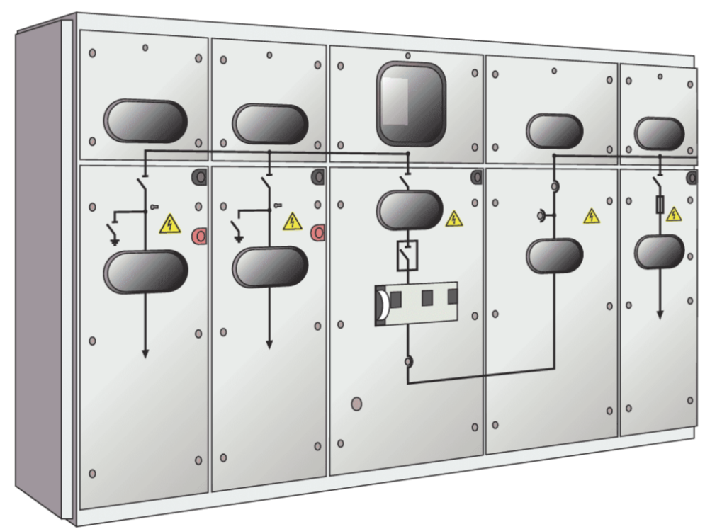  

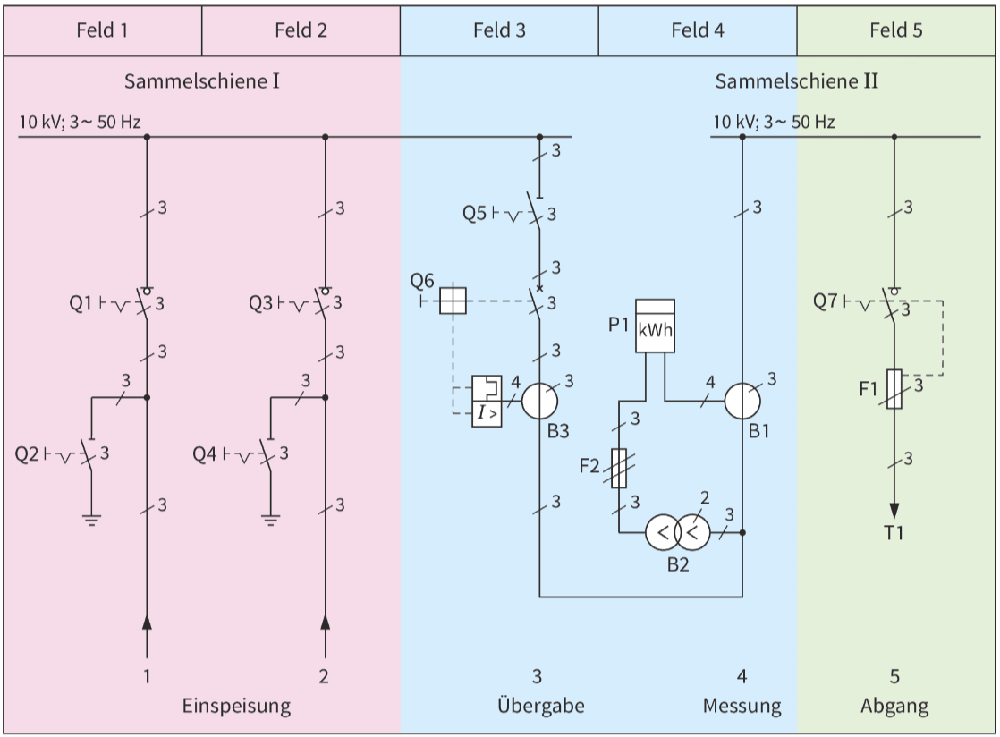

## Transformatoren [^1]

Die Drehstrom-Transformatoren wurden bereits im Lernfeld 5 behandelt. Die Schaltgruppen, deren Eigenschaften sowie der Schutz von Transformatoren wurden dort erläutert. Wir beschäftigen uns deshalb hier nur mit dem Transformator Tl unserer Anlage.

 
 
### Analyse wichtiger Bemessungsdaten

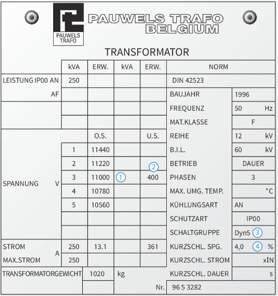  

- **Oberspannung: 11 kV `1`** Da der Transformator Tl für eine Bemessungsspannung von 10 kV benötigt wird, ist die Primärseite füreine Spannungserhöhung bis zu 10 % ausgelegt.
- **Unterspannung: 400 V `2`** Die Sekundärseite gibt die gewünschte Netzspannung ab.
- **Schaltgruppe: Dyn5 `3`** Die Wicklungen der Primärseite sind im Dreieck (D), die Sekundärseite ist im Stern (y) geschaltet, weil das anschließende Verbrauchernetz die verketteten Spannungen benötigt. Deshalb ist auch der Neutralleiter (n) herausgeführt. Die Kennzahl 5 gibt an, dass die Sekundärspannung der Primärspannung um 5 x 30° nacheilt.
- **Relative Kurzschlussspannung: 4 % `4`** Die Kurzschlussspannung lässt Rückschlüsse auf den Spannungsfall zu. Sie kann durch den mechanischen Aufbau von Kern und Spulen beeinflusst werden. Je enger die Primär- und Sekundärspulen beieinander liegen, desto kleiner ist die Kurzschlussspannung. Der Wert = 4 % ist für solche Transformatoren ein üblicher Wert.

Sollte die Leistung des Transformators Tl (250 kVA) für die Versorgung der Anlage nicht ausreichen, muss ein zweiter Transformator parallel geschaltet werden. Bei der Parallelschaltung von Spannungsquellen müssen alle Ausgangsspannungen zu jedem Zeitpunkt gleich sein. Ist dies nicht der Fall, fließen **Ausgleichsströme [circulation currents]**. Diese Ströme fließen auch, wenn keine Last angeschlossen ist. Man nennt sie auch Kreisströme. Abb. 4 zeigt ein vereinfachtes Ersatzschaltbild zweier Spannungsquellen. Die Differenzspannung $\Delta U$ verursacht einen Stromfluss nur innerhalb der Spannungsquellen. Die Spannungsquelle wird damit belastet, ohne Energie an die Verbraucher
abzugeben.

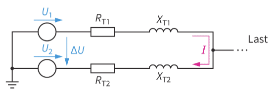  

### Welche Anforderungen muss der parallel zu schaltende Transformator erfüllen?

Wie bei jeder Parallelschaltung von Spannungsquellen muss auch hier darauf geachtet werden, dass kein Ausgleichsstrom [circulating current] zwischen den Objekten fließen kann. Dies wird immer dann erreicht, wenn beide Transformatoren identisch sind. Das ist aber üblicherweise nicht der Fall. Um angenähert diesen Zustand zu erreichen, schreibt DIN VDE 0532 folgende Bedingungen vor:

- **Gleiche Bemessungsspannungen:** Ungleiche Sekundärspannungen führen zu Ausgleichsströmen (von der höheren Spannung zurniedrigeren Spannung).
- **Gleiche Kennzahlen:** Ungleiche Kennzahlen bedeuten ungleiche Phasenlagen. Auch das führt zu Ausgleichsströmen.
- **Möglichst gleiche Übersetzungsverhältnisse:** Damit wird erreicht, dass die Unterspannungen auch im Leerlauf gleich groß sind.
- **Nahezu gleiche Kurzschlussspannungen:** Ungleiche Kurzschlussspannungen führen zu ungleichmäßigen Belastungen der Transformatoren. Der Transformator mit der geringeren Kurzschlussspannung wird möglicherweise überlastet.
- **Verhältnis der Bemessungsleistungen < 3:1:** Bei größeren Leistungsverhältnissen würde der „kleinere" Transformator überlastet werden.

### Zusammenfassung Transformatoren

- Ausgleichsströme belasten Transformatoren, ohne dass eine Energieübertragung zur Last vorliegt.
- Gleiche Transformator-Kenngrößen vermeiden Ausgleichsströme.

### Verständisfragen Transformatoren

**Erläutern Sie die wichtigsten Bemessungsdaten eines Transformators!**

**Erklären Sie welche Anforderungen parallel geschaltete Transformator erfüllen sollten?**

### Quizz Transformatoren

**Ordnen Sie die im folgenden Typenschild gekennzeichneten Bemessungsdaten zu!**

<!-- 
    data-randomize 
    data-solution-button="off"
-->
- [[1] [2] [3] [4]]
- [(x) ( ) ( ) ( )]  Oberspannung
- [( ) (x) ( ) ( )]  Unterspannung
- [( ) ( ) (x) ( )]  Schaltgruppe
- [( ) ( ) ( ) (x)]  Relative Kurzschlusspannung

**Welche Anforderungen müssen parallel zu schaltende Transformator erfüllen?**

<!-- 
    data-randomize 
    data-solution-button="off"
-->
[[x]] Gleiche Bemessungsspannungen
[[x]] Gleiche Kennzahlen
[[x]] Möglichest gleiche Übersetzungsverhältnisse
[[x]] Nahezu gleiche Kurzschlussspannungen
[[x]] Verhältnis der Bemessungsleistungen < 3:1

[^1] Die Inhalte dieses Kapitels beinhalten Ausszüge aus dem Buch Elektrotechnik Betiebstechnik Lernfelder 5-13; 3. Auflage; Westermann Bildungsmedien Verlag GmbH; Kapitel 10.2.4
## Messeinrichtung [^2]

Die folgende Abbildung zeigt einen Ausschnitt aus dem Übersichtsschaltplan der Mittelspannungsschaltanlage der Firma Metallbau KG. Für den Zähleranschluss sind die Wandler B1 und B2 vorbereitet. Bevor jetzt Zähler installiert werden, müssen die Aufgaben,Schaltungen und Schutzmaßnahmen der Wandler bekannt sein. Im Folgenden werden deshalb die notwendigen Erläuterungen gegeben.

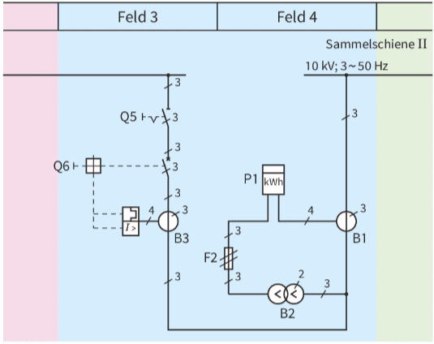

### Wie werden Wandler eingesetzt?

Wandler sind Transformatoren, die entweder

- hohe Spannungen (Spannungswandler) oder
- hohe Stromstärken (Stromwandler)

auf niedrige Werte transformieren. Die daran anzuschließenden Zähleinrichtungen können dann kleinere Abmessungen und eine geringe Isolation besitzen.

**Spannungswandler [voltage transformer]** werden häufig in der V-SchaItung `1` betrieben, weil dabei nur zwei Objekte notwendig sind. Um die Wicklungen und den angeschlossenen Zähler gegen Überlastung zu schützen, muss die Sekundärseite `2` abgesichert werden.

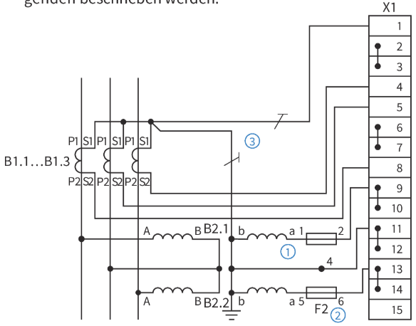  

**Stromwandler [current transformer]** dürfen auf keinen Fall im Leerlauf betrieben werden, weil offene Klemmen einen großen Widerstand darstellen. Durch das Transformieren wird der Primärkreis - und damit die Anlage - stark belastet ($R_1 = R_2 \cdot ü^2$). An den Offenen Klemmen ergibt sich wegen des großen Widerstandes ($R_2 \rightarrow \infty$) eine hohe Spannung, die für Personen und Anlagen gefährlich ist. Daraus folgt, dass Stromwandler nicht abgesichert werden dürfen. Im Leerlauf werden die Sekundärwicklungen kurzgeschlossen, damit ist der Widerstand nahezu Null.

Beide Wandlerarten müssen in Mittel- und Hochspannungsanlagen sekundärseitig an den Schutzleiter `3` und damit an die Erde angeschlossen werden.

### Wie werde die Zähler angschlossen?

Hierzu muss eine Bestandsaufnahme gemacht und festgelegt werden, welche Größen gemessen werden sollen. Wir gehen deshalb in folgenden drei Schritten vor:

1. Welche Objekte sind vorhanden?
2. Was soll gezählt werden?
3. Wie werden die Messgeräte angeschlossen?

#### Vorhandene Objekte

Aus dem Übersichtsschaltplan ist zu ersehen, dass zwei Wandler installiert sind. Ihre Anschlüsse sind auf die Klemmleiste X1 geführt.

#### Benötigte Zähler

In der beschriebenen Anlage sollen die Wirkarbeit und die Blindarbeit gemessen werden. Es werden deshalb zwei Zähler benötigt.

Der **Wirkarbeitszähler [watthour meter]** misst die gelieferte elektrische Energie. Der Zähler wird in der Aron-Schaltung verwendet, weil damit sowohl symmetrische als auch unsymmetrische Belastungen gemessen werden können.

Der **Blindarbeitszähler** ist notwendig, weil der Produktionsbetrieb der Firma Metallbau KG viele Motoren installiert hat und die Kompensationsanlage die Blindleistung nicht vollständig kompensiert.

#### Anschluss der Zähler

Beide Zähler werden an die Klemmleiste X1 angeschlossen.

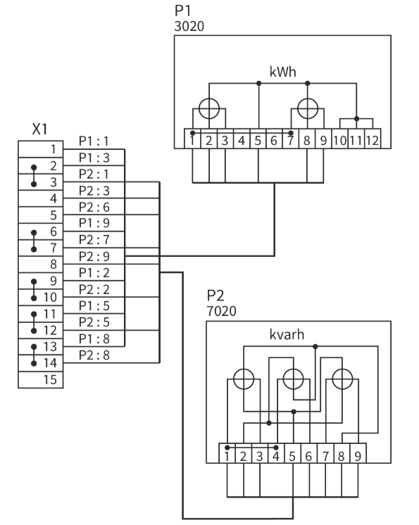

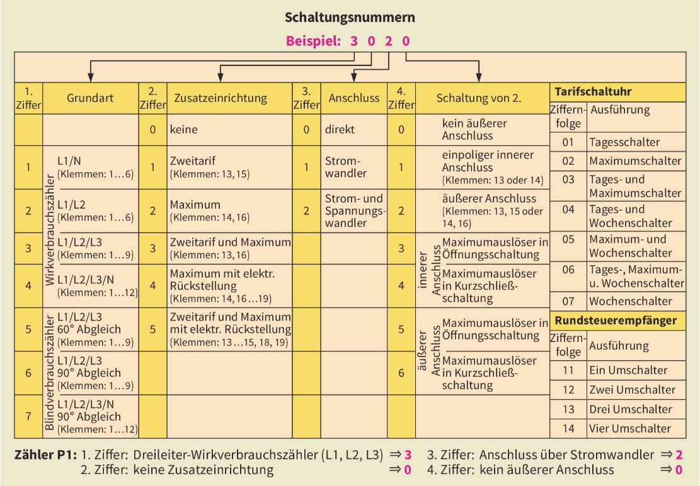

Für die vorgestellte Mittelspannungsanlage nimmt ein Mitarbeiter des betreffenden VNB diese Anschlussarbeiten vor. Da sie als neue Schaltanlage zunächst spannungsfrei ist, kann die Installation einfach durchgeführt werden. Sollen in einer bestehenden Anlage Zähler ausgewechselt werden, sind weitere Schalthandlungen notwendig, die im Folgenden beschrieben werden.

Beim Zähleraustausch müssen folgende Schritte in der aufgeführten Reihenfolge eingehalten werden:

1. Stromwandler kurzschließen
2. Sicherungen aus den Spannungswandler-Leitungen entfernen.
3. Zähler entfernen
4. Neuen Zähler einbauen und anschließen
5. Sicherungen in Spannungswandler-Zuleitungen einsetzen
6. Kurzschluss-Brücken bei Stromwandlern entfernen.

### Zusammenfassung Messeinrichtungen

- In Mittel- und Hochspannungs-Schaltanlagen werden die Zähler über Wandler angeschlossen.
- Stromwandlerklemmen dürfen nicht offen sein. Entweder ist ein Gerät angeschlossen oder die Klemmen sind kurzgeschlossen.
- Stromwandler dürfen nicht abgesichert werden.
- Spannungswandler müssen abgesichert werden.

### Verständnisfragen Messeinrichtung

**Wie werden Wandler Eingestetzt?**

**Erläutern Sie wie Zähler angeschlossen werden!**

### Quizz Messeinrichtungen

**Ordnen Sie die Schritte beim Zählertausch chronologisch!**

<!-- 
  data-randomize 
  data-solution-button="off"
-->
- [[1.] [2.] [3.] [4.] [5.] [6.]]
- [(x) ( ) ( ) ( ) ( ) ( )]  Stromwandler kurschließen
- [( ) (x) ( ) ( ) ( ) ( )]  Sicherungen aus den Spannungswandler-Leitungen entfernen.
- [( ) ( ) (x) ( ) ( ) ( )]  Zähler entfernen
- [( ) ( ) ( ) (x) ( ) ( )]  Neuen Zähler einbauen und anschließen
- [( ) ( ) ( ) ( ) (x) ( )]  Sicherungen in Spannungswandler-Zuleitungen einsetzten
- [( ) ( ) ( ) ( ) ( ) (x)]  Kurzschluss-Brücken beim Stromwandler entfernen

[^2] Die Inhalte dieses Kapitels beinhalten Ausszüge aus dem Buch Elektrotechnik Betiebstechnik Lernfelder 5-13; 3. Auflage; Westermann Bildungsmedien Verlag GmbH; Kapitel 10.2.5

## Schalthandlungen [^3]

Die **Mittelspannungs-Schaltanlage** der Firma Metallbau KG ist neu errichtet worden. Sie soll erstmalig in Betrieb genommen werden. Alle vorgeschriebenen Prüfungen sind ordnungsgemäß durchgeführt worden. Die Ergebnisse entsprechen den Vorschriften. Um die Anlage in Betrieb nehmen zu können, müssen verschiedene Schalthandlungen durchgeführt werden. Wir erläutern dazu im Folgenden die grundsätzliche Vorgehensweise.

Das Schalten in Mittelspannungsanlagen muss wegen des erhöhten **Gefährdungspotenzials** besonders sorgfältig geplant werden. Um Gefahren für Personen zu vermeiden, gibt es in der DIN VDE 0105-100 eine Reihe von Regelungen für das Arbeiten und damit auch das Schalten in elektrischen Anlagen. Im Folgenden werden drei Bereiche besprochen.

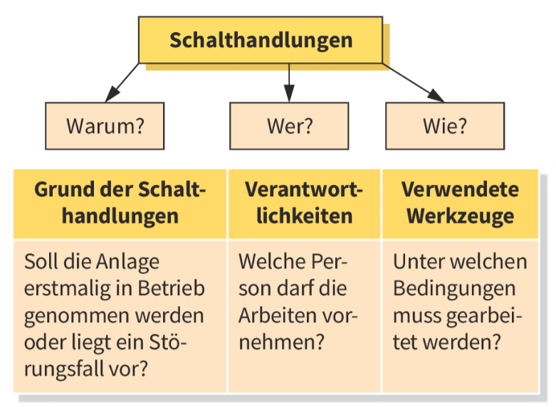

### Warum werden Schalthandlungen notwendig?

Unter **Schalthandlungen [switching actions]** werden sämtliche Schaltvorgänge in Anlagen verstanden.
Es wird unterschieden zwischen

- betriebsbedingtem Schalten, z. B. Starten oder Stillsetzen von Betriebsmittel nund
- arbeitsbedingtem Schalten,z. B. Ausschalten von Trennern.

Die arbeitsbedingten Schalthandlungen sind erforderlich, um Reparaturen durchzuführen, Störungen zu beseitigen oder Wartungsarbeiten zu erledigen. Wenn Anlagen keinen ausreichenden Schutz für Personen gegen Auswirkungen von Störlichtbögen haben, dürfen z. B. beim Schalten von Trennschaltern nur Personen anwesend sein, die mit der Schalthandlung zu tun haben. Alle Beteiligten müssen dabei die **persönliche Schutzausrüstung** tragen, die je nach Gefährdungsgrad der betreffenden Anlage festgelegt wurde.

Beim Schalten in **Anlagen über 1 kV** sind die Reihenfolge der Schaltvorgänge und die beteiligten Schalteinrichtungen schriftlich festzuhalten.

### Wer ist für die Arbeiten verantwortlich?

Zunächst müssen die Zuständigkeiten der betreffenden Personen eindeutig definiert sein. Hierbei gibt es zwei Unterscheidungsmerkmale, nämlich die **Fachkompetenz [professional competence]** und die **Verantwortlichkeit [responsibility]**.

Auf Grund der unterschiedlichen Fähigkeiten ergeben sich zwei Gruppen von Arbeitsausführenden. Die **Elektrofachkraft(EFK)** hat die geeignete elektrotechnische Ausbildung, die fachlichen Kenntnisse und betreffende Erfahrungen. Dadurch kann sie die Gefahren einschätzen und vermeiden.

Eine **elektrotechnisch unterwiesene Person (EUP)** wird durch Elektrofachkräfte für bestimmte elektrotechnische Aufgaben unterrichtet. Sie kann daher die möglichen Gefahren erkennen und setzt die Schutzmaßnahmen und -einrichtungen richtig ein.

Bei der Verantwortlichkeit wird zwischen dem **Anlagenverantwortlichen** und dem **Arbeitsverantwortlichen** unterschieden. Sie tragen jeweils die unmittelbare Verantwortung und haben damit die betreffende Entscheidungsbefugnis. Arbeitsverantwortliche sind besonders für die Freigabe zur Arbeit und nach Erledigung der Arbeit für das Unterspannungsetzen zuständig. Häufig sind Anlagenverantwortliche und Arbeitsverantwortliche ein und dieselbe Person.

Der Arbeitsverantwortliche legt zusammen mit dem Anlagenverantwortlichen die Arbeitsschritte und damit auch die Schaltvorgänge fest. Er führt als Elektrofachkraft die Arbeiten selbst aus Oder gibt sie verantwortlich an eine andere Person (EFK oder EUP) weiter.

### Durchführung von Schalthandlungen

Als Beispiel für Schalthandlungen wird hier der Einbau der Zähler in die Schaltanlage der Firma Metallbau KG dargestellt. Hierfür sind die Mitarbeiter des betreffenden
VNB zuständig. Sie gehen nach erfolgtem Zählereinbau folgendermaßen vor.

1. Erdungstrennschalter Q2 und Q4 öffnen $\Rightarrow$ Erdschluss aufgehoben und verriegeln (Wiedereinschaltsperre) $\Rightarrow$ neuen Erdschluss verhindert.
2. Schließen der Schalter (nicht dargestellt) in Einspeisungen 1 und 2 $\Rightarrow$ 10 kV an Zuleitungen
3. Lasttrennschalter Ql und Q3 schließen $\Rightarrow$ 10 kV an Sammelschine I
4. Trennschalter Q5 schließen $\Rightarrow$ Übergabe eingeleitet
5. Leistungsschalter Q6 schließen $\Rightarrow$ 10 kV an Sammelschiene $\Rightarrow$ Übergabe vollzogen

Der Arbeitsverantwortliche schaltet die Niederspannungsverteilung mit folgenden Schalthandlungen zu.

- Hochspannungs-Hochleistungs-Sicherung Fl einsetzen $\Rightarrow$ Abgang gegen Überlastung gesichert
- Lasttrennschalter Q7 schließen $\Rightarrow$ Transformator mit Niederspannungsanlage in Betrieb

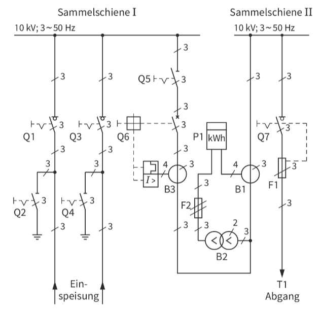

Aus diesem Beispiel ergibt sich folgende grundsätzliche Reihenfolge beim Inbetriebsetzen:

1. Maßnahmen zum Wiedereinschaltschutz aufheben.
2. Anlagenteile in Richtung Verbraucher zuschalten, d. h. Schaltgeräte in der Reihenfolge „steigendes Schaltvermögen" (Leer-, Last-, Leistungsschalter) einschalten.
3. Verbraucheranlage zuschalten.

### Wie sehen die Arbeitsbedingungen aus?

Bei allen Arbeiten in elektrischen Anlagen müssen die „Fünf Sicherheitsregeln" befolgt werden. Der Arbeitsverantwortliche führt diese selbst durch oder lässt sie von einer anderen Fachkraft erledigen. Dann muss er sich aber die Durchführung bestätigen lassen.

Die Einhaltung der Regel „Freischalten" kann besonders bei Mittelspannungsanlagen zu Problemen führen. Oft versorgen sie Produktionsanlagen, deren Abschaltung finanziellen Schaden für die betreffende Firma verursacht oder es sind lebenswichtige Objekte (z. B. im Krankenhaus) angeschlossen. In beiden Fällen darf die Anlage nicht abgeschaItet werden. Der Elektroniker muss dann entweder unter Spannung oder in der Nähe von Spannung führenden Objekten arbeiten.

Es ergeben sich daraus drei Arbeitsbedingungen mit den entsprechenden Folgerungen.

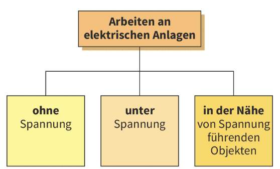  

#### Arbeiten ohne Spannung

Wegen der hohen Spannung müssen beim Befolgen der Sicherheitsregeln folgende Hinweise beachtet werden:

- Nach dem Freischalten müssen die Trennstellen gegen Überschlag abgesichert werden, z. B. durch Isolierstücke.
- Wenn zum Schalten der Objekte Hilfsenergie [auxiliary energy] benötigt wird, muss diese während der Arbeitszeit abgeschaltet werden.
- Von der Arbeitsstelle aus muss die Erdungs- und Kurzschlusseinrichtung eingesehen werden können.

#### Arbeiten unter Spannung

Unter Spannung darf nur gearbeitet werden, wenn keine Brand- oder Explosionsgefahr besteht. Bei ungünstigen Witterungsverhältnissen (z. B. hohe Luftfeuchtigkeit) müssen Arbeiten im Freien sofort abge-brochen werden. In Notfällen muss die betreffende Leitung abgeschaltet werden.

An den Elektroniker und sein Werkzeug werden folgende Voraussetzungen geknüpft:

- Die Elektrofachkraft oder die elektrotechnisch unterwiesene Person müssen eine spezielle Ausbildung haben.
- Die Elektroniker müssen die vorgeschriebene **persönliche Schutzausrüstung [personal protective equipment]** tragen.
- Das Werkzeug muss für die Bemessungsspannung geeignet und entsprechend gekennzeichnet sein.
- Der ordnungsgemäße Zustand der Werkzeuge und Schutzeinrichtungen muss regelmäßig überprüft
  werden.
- Nach Absprache der Verantwortlichen ergeht an den Ausführenden eine spezielle Anweisung.

#### Arbeiten in der Nähe von Spannung führenden Objekten

Hierunter sind Arbeiten zu verstehen, die innerhalb eines bestimmten Bereiches um den Spannung führenden Teil (z. B. blanke Leiterschienen) durchgeführt werden müssen. Dieses Gebiet ist die **Annäherungszone [vicinity zone]** (Abstand $D_\text{v}$). Sie hängt von der Bemessungsspannung ab.

**Beispiele:**

$ U_\text{N} = 3 \text{ kV} \Rightarrow D_\text{V} = 1,12 \text{ m} \Rightarrow D_\text{L} = 6 \text{ cm} $

$ U_\text{N} = 110 \text{ kV} \Rightarrow D_\text{V} = 2,00 \text{ m} \Rightarrow D_\text{L} = 1 \text{ m} $

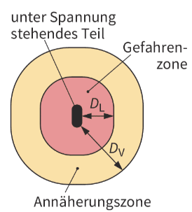

Gemäß der Sicherheitsregel 5 müssen alle unter Spannung stehenden Anlagenteile sicher abgedeckt sein. Ist das nicht gewährleistet, wird nach der Arbeitsmethode **„Abstand und Aufsicht"** verfahren. Hierbei wird in der Annäherungszone unter Aufsicht gearbeitet, damit die Elektrofachkräfte nicht in die **Gefahrenzone [danger zone]** geraten. In dieser Zone dürfen keine Arbeiten vorgenommen werden. Der Abstand $D_\text{L}$ vom Spannung führenden Objekt ist ebenfalls abhängig von der Bemessungspannung.

Auch für Arbeiten in der Nähe von unter Spannung stehenden Teilen gelten besondere Anforderungen:

- Jeder Arbeitende muss eine Zusatzqualifikation für diese Arbeiten haben.
- Der Arbeitsverantwortliche muss die Arbeitenden vor Ort einweisen und beaufsichtigen.
- Die Arbeitsstelle muss nach außen kenntlich gemacht werden, z. B. durch Abschrankungen und Schilder.

### Zusammenfassung Schalthandlungen

- Schalthandlungen müssen bei Mittelspannungsanlagen besonders sorgfältig geplant, durchgeführt und dokumentiert werden.
- Eine Elektrofachkraft hat eine elektrotechnische Ausbildung.
- Eine elektrotechnisch unterwiesene Person ist für bestimmte elektrotechnische Arbeiten unterwiesen.
- Die Arbeitsschritte werden von Anlagen- und Arbeitsverantwortlichen gemeinsam festgelegt.
- Arbeiten in Mittelspannungs-Schaltanlagen werden durchgeführt:
  - ohne Spannung,
  - unter Spannung oder
  - in der Nähe von Spannung führenden Teilen.
- Nach dem Freischalten von Anlagen mit hoher Spannung müssen die Trennstrecken besonders isoliert werden.
- Für Arbeiten unter Spannung muss der Arbeitende eine spezielle Ausbildung besitzen und eine entsprechende persönliche Schutzausrüstung tragen.
- Beim Arbeiten in der Nähe von unter Spannung stehenden Teilen ist eine Aufsicht erforderlich, um den Arbeitenden vor Erreichen der Gefahrenzone zu bewahren.

### Verstädnisfragen Schalthandlungen

1. **Nennen Sie drei Beispiele für arbeitsbedingte Schalthandlungen.**

2. **Erläutern Sie den Aufgabenbereich eines Arbeitsverantwortlichen.**

3. **Geben Sie die Unterschiede und Gemeinsamkeiten der Anforderungen an Elektrofachkraft und elektrotechnisch unterwiesene Person an.**

4. **Warum kann das Freischalten bei Mittelspannungsanlagen zu Problemen führen?**

5. **Wie werden Trennstellen nach dem Freischalten in Mittelspannungsanlagen gesichert?**

6. **Welche Voraussetzungen müssen erfüllt sein, um unter Spannung arbeiten zu dürfen?**

7. **Welche besondere Aufgabe hat der Arbeitsverantwortliche bei Arbeiten in der Nähe von unter Spannung stehenden Objekten?**

### Quizz Schalthandlungen

**1. Ab welche Spannung sind die Reihenfolge der Schalvorgänge sowie die dabei beteiligten Schalteinrichtungen schriftlich festzuhalten?**

<!-- 
  data-randomize 
  data-solution-button="off"
-->
- [[x]] 1 kV
- [[ ]] 400 V
- [[ ]] 400 kV
- [[ ]] 20 kV

**2. Wie wird eine Person gennant, die durch eine Elektrofachkraft zur Durchführung für bestimmte elektrotechnische Aufgaben unterrichtet wird?**

<!-- 
  data-randomize 
  data-solution-button="off"
-->
- [[x]] EUP
- [[ ]] EFK
- [[ ]] Anlagenverantwortlicher
- [[ ]] Arbeitsverantwortlich

**3. Ordnen Sie Arbeitsschritte beim Inbetriebnehmen in chronologische Reihenfolge!**

<!-- 
    data-randomize 
    data-solution-button="off"
-->
- [[1] [2] [3]]
- [(x) ( ) ( )]  Maßnamen zum Wiedereinschaltschutz aufheben.
- [( ) (x) ( )]  Anlagenteile in Richtung Verbrauer zuschalten.
- [( ) ( ) (x)]  Verbraucheranlage zuschalten.

**4. Welche Anwendungshinweise gelten beim Arbeiten ohne Spannung?**

<!-- 
  data-randomize 
  data-solution-button="off"
-->
- [[x]] Nach dem Freischalten müssen die Trennstellen gegen Überschlag gesichert werden.
- [[x]] Wenn zum Schalten der Objekte Hilfenergie benötigt wird, muss diese während der Arbeitszeit abgeschaltet werden.
- [[x]] Von der Abeitsstelle aus muss die Erdungs- und Kurzschlusseinrichtung eingesehen werden können.
- [[ ]] Vor dem Freischalten müssen die Trennstellen gegen Überschlag gesichert werden.
- [[ ]] Wenn zum Schalten der Objekte Hilfenergie benötigt wird, darf diese während der Arbeitszeit angeschaltet bleiben.

**5. Welche Vorraussetzung sind an den Elektroniker und dessen Werkzeug für das Arbeiten unter Sapnnung geknüpft?**

<!-- 
  data-randomize 
  data-solution-button="off"
-->
- [[x]] Die Elektrofachkraft oder die elektrotechnisch unterwiesene Person müssen eine spezielle Ausbildung haben.
- [[x]] Die Elektroniker müssen die vorgeschriebene persönliche Schutzausrüstung tragen.
- [[x]] Das Werkzeug muss für die Bemessungsspannung geeignet und entsprechend gekennzeichnet sein.
- [[x]] Der ordnungsgemäße Zustand der Werkzeuge und Schutzeinrichtungen muss regelmäßig überprüft werden.
- [[x]] Nach Absprache der Verantwortlichen ergeht an den Ausführenden eine spezielle Anweisung.

**6. Welche Anforderungen gelten für Arbeiten in der Nähe von Spannung stehenden Teilen?**

<!-- 
  data-randomize 
  data-solution-button="off"
-->
- [[x]] Jeder Arbeitende muss eine Zusatzqualifikation für diese Arbeiten haben.
- [[x]] Der Arbeitsverantwortliche muss die Arbeitenden vor Ort einweisen und beaufsichtigen.
- [[x]] Die Arbeitsstelle muss nach außen kenntlich gemacht werden.
- [[ ]] Arbeitende benötigen keine Zusatzqualifikation für diese Arbeiten.
- [[ ]] Die Anwesenheit eines Arbeitsverantworlichen ist nicht notwendig

[^3] Die Inhalte dieses Kapitels beinhalten Ausszüge aus dem Buch Elektrotechnik Betiebstechnik Lernfelder 5-13; 3. Auflage; Westermann Bildungsmedien Verlag GmbH; Kapitel 10.2.6