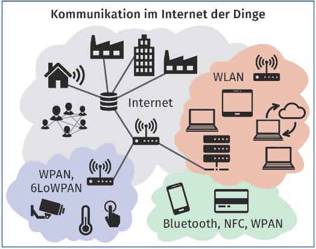
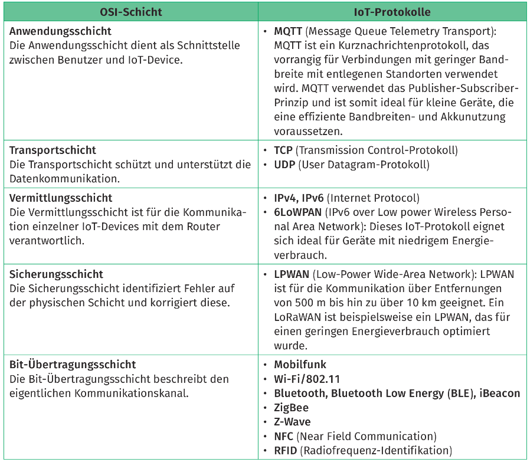

<!--
author:   J.Müller

email:    Jan.Mueller4@schule.hessen.de

version:  0.0.1

language: Deutsch

narrator: Deutsch Female

comment:  Sie sollen in unterschiedlichen Teams die gesamte Kommunikation zwischen cyber-physischen Systemen untersuchen, erläutern und präsentieren.

link:     https://cdn.jsdelivr.net/chartist.js/latest/chartist.min.css

script:   https://cdn.jsdelivr.net/chartist.js/latest/chartist.min.js

translation: Deutsch  translations/German.md

translation: Français translations/French.md
-->

# Kommunikation zwischen cypber-physischen Systemen

Ein wichtiges Kriterium für den Erfolg oder Misserfolg einer IoT-Anwendung Kommunikation im Internet der Dinge ist die Auswahl des richtigen Protokolls für die Kommunikation im Netz. Bei der Kommunikation zwischen Geräten in IoT-Netzwerken werden verschiedene WLAN IoT Kommunikationsprotokolle verwendet. Es wurden unterschiedliche Protokolle entwickelt, um den verschiedenen Internet Anforderungen von IoT-Produkten und -Diensten gerecht zu werdenn. Wenn ein Sensor, z. B. ein Temperatursensor, nur WPAN, wenig Datenmengen übertragen muss, 6LoWPAN sollte er auch nur wenig Energie verbrauchen. Andere Sensoren müssen sich an einem festen Ort befinden, da sie Bluetooth, NFC, WPAN mit 230 V Netzspannung versorgt werden müssen. Das Schaubild verdeutlicht, dass innerhalb eines Netzwerks viele unterschiedliche Protokolle zum Einsatz kommen können.

  

Bei der Entwicklung von IoT-Produkten und -Dienstleistungen sind folgende Faktoren zu berücksichtigen:

- die Datenmenge und Datenübertragungsrate, die für den geforderten Anwendungsfall zu übertragen ist,
- die Energieeffizienz bzw . der Energiebedarf des cyber-physischen Systems,
- die Relevanz einer Verzögerung der Datenübertragung.

## IoT-Protokolle und Industrial-Internet-Protokolle unterscheiden

Um die zahlreichen unterschiedlichen Protokolle einzuordnen, ist zuerst die Zuordnung zu den entsprechenden OSI-Schichten notwendig. Danach können die unterschiedlichen IoT-Protokolle der Bit-Übertragungsschicht näher betrachtet werden. Speziell für die Anwendungsschicht wird im nächsten Kapitel auf das MQTT-Protokoll eingegangen.

  

