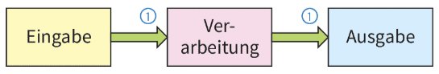
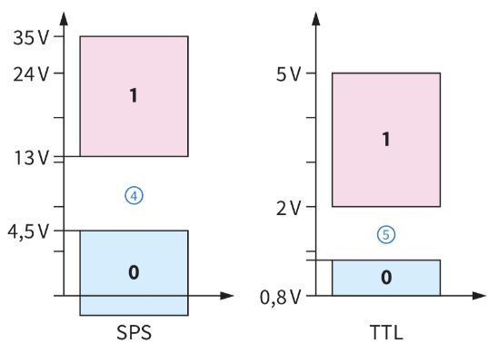
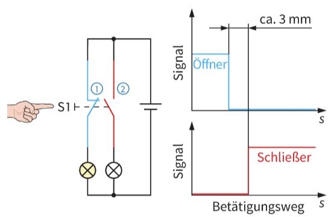
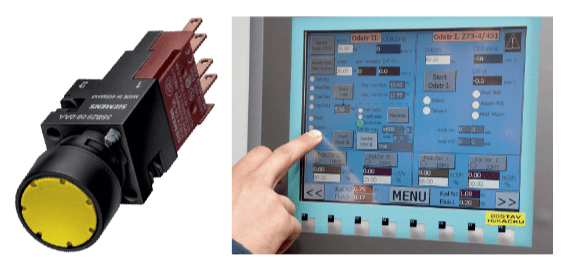
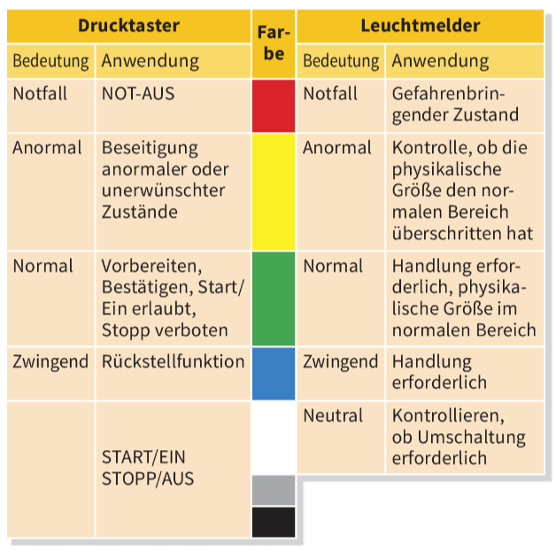
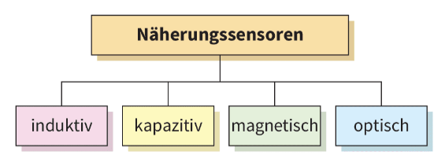
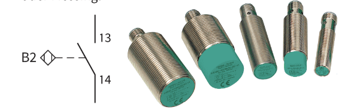
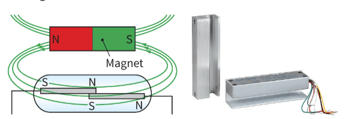
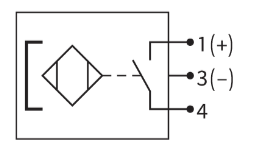

<!--
author:   J.Müller

email:    Jan.Mueller4@schule.hessen.de

version:  0.0.1

language: Deutsch

narrator: Deutsch Female

comment:  

link:     https://cdn.jsdelivr.net/chartist.js/latest/chartist.min.css

script:   https://cdn.jsdelivr.net/chartist.js/latest/chartist.min.js

translation: Deutsch  translations/German.md

translation: Français translations/French.md
-->

# Eingabeobjekte

## Signale

Nach dem EVA-Prinzip wird eine Steuerung in die drei Ebenen Eingabe, Verarbeitung und Ausgabe eingeteilt. Diesem Prinzip folgend sollen zunächst
die Informationsquellen (**Sensoren** [sensors] und Bedienelemente [operating devices]) sowie die Objekt betrachtet werden, die die Verarbeitungsergebnisse im System umsetzen (Aktoren [actuators]).

Bei der stark vereinfachten Systemdarstellung (Abb. 1 ) wird deutlich, dass die Signale der Eingabeebene in der Verarbeitungsebene ausgewertet werden, bzw. die Verarbeitungsergebnisse an die Aktoren (Ausgabe) übermittelt werden.

Die Ausgangsinformationen des vorangehenden Objektes stellen die Eingangsinformationen des folgenden Objektes dar 1. Diese Übergabepunkte werden
Schnittstellen [interfaces] genannt. Schnittstellen sind normiert, da in der Steuerungstechnik oftmals Produkte unterschiedlicher Hersteller Verwendung finden und daher zueinander kompatibel sein müssen.

  

### Binärsignale

Bei Binärsignalen sind nur zwei Zustände möglich (bi: lat. zwei). Diese können sehr einfach ausgewertet werden und lassen sich durch Pegel darstellen.

|Hoher Pegel | Niedrieger Pegel |
|------------|------------------|
| An | Aus |
| High | Low |
| H | L |
| 1 | 0 |

#### Beispiel

- Ein unbetätigter Schließer (Kontakt, der im unbetätigten Zustand geöffnet ist, (2)) ist „0", „Aus" oder „Low" (kurz „L").
- Ein betätigter Schließer @ ist „1", „An"oder „High" (kurz „H").

 

während der Pegel den Zustand bzw. das Signalniveau beschreibt, verbirgt sich hinter dieser sehr allgemeinen Eingabe ein von der eingesetzten Steuerung abhängiger Spannungsbereich. Die in der Steuerungstechnik gängigsten Bereiche sind 0 12 V, 0 V... 24 V und 0 V...230 v.

Dabei wird ein niedriger Spannungsbereich als „0"-Signal und ein hoher als „1 "-Signal festgelegt. Dazwischen liegt der „verbotene Bereich" 4, 5 als eindeutige Trennung zwischen den Pegeln (Abb. 3). In dieser Zone kann ein Signal keinem Pegel korrekt zugeordnet werden.

   

### Analoge Signale

Der Windsensor der Windenergieanlage liefert ein analoges Signal. Dieses kann in einem begrenzten Bereich jeden beliebigen Wert annehmen. So entspricht eine Ausgangsspannung von z. B. 4,5 V einer bestimmten Windstärke.

Viele Sensoren verwenden folgende genormten Schnittstellenwerte für Analogsignale:

- 0 V bis 10 V
- 4 mA bis 20 mA
- 0 mA bis 20 mA

### Zuammenfassung

- Damit die Objekte einer Steuerung zusammen arbeiten können, müssen ihre Schnittstellen angepasst sein.
- Binärsignale werden bestimmten Pegeln zugeordnet. Dabei ist das 1-Signal der höhere Pegel und das 0-Signal der niedrigere Pegel.
- Analogsignale werden im Bereich der Automatisierungstechnik meist in den Größen 0 V bis 10 V, 4 mA bis 20 mA oder O mA bis 20 mA dargestellt.

## Bedienelemente

Bedienelemente können Taster oder Schalter sein. Da sie zur Befehlseingabe von Hand eingesetzt werden, stellen sie die Verbindung zwischen Mensch und Steuerung her. Im Folgenden werden die Bedienelemente und Sensoren der Windenergieanlage mit ihren Alter- nativen vorgestellt.

Drucktaster, Schalter und Touch-Panel werden zur Befehlseingabe von Hand verwendet, wenn z. B. zwischen Hand- und Automatikbetrieb gewählt wird. In der Sturmschutz-Steuerung kommen sie zum Einsatz, wenn ein Zeitglied vorzeitig zurückgesetzt(quittiert) werden soll, um den Rotor vorzeitig wieder in den Wind zu fahren.

### Drucktaster und Schalter

Ist ein Taster (Abb. 4) sowohl mit Schließer- als auch Öffner-Kontakten ausgestattet, muss beachtet werden, dass bei einer Betätigung immer zunächst der Öffnerkontakt (1) öffnet, bevor der Schließerkontakt (2) schließt (Tasterverriegelung).
Dieser Zusammenhang ist in dem Signal-Betätigungsweg-Diagramm der Abb. 4 verdeutlicht.

  

Die Farbe des Tasters (Abb. 5) weist auf die Funktion hin. Entsprechend der Abb. 6 werden den unterschiedlichen Bedeutungen und Anwendungen bestimmte Farben zugeordnet. Die Farbe Gelb wird zur Beseitigung einer anormalen Bedingung oder unerwünschten Änderung verwendet. Bei der Windenergieanlage wird Gelb daher für die Quittierung der Sturmschutz-Zeit verwendet. Weitere festgelegte Farbkennzeichnungen gelten in ähnlicher Form auch für Leuchtmelder und Leuchtdrucktaster[illuminated pushbuttons], in denen ein Leuchtmelder integriert ist.

  

  

### Touch-Panel

Alternativ zu den klassischen Bedienelementen Taster und Schalter werden zunehmend Touch-Panel eingesetzt (häufig als Human-Machine-lnterface, HMI
bezeichnet). Dabei handelt es sich um berührungssensitive Bildschirme, auf denen Schaltflächen, Leuchtmelder, Ein-Ausgabe-Felder, frei skalierbare Festtexte, Grafiken und dynamische Balken zur Darstellung von
Prozessgrößen angezeigt werden können. Durch Antippen der berührungssensitiven Bildschirmoberfläche können die Bedienfunktionen aktiviert werden. Die Informationen von und zum Panel werden direkt über eine Busleitung oder eine Parallelverdrahtung mit der Steuerung ausgetauscht. Die Anzeige kann mit einer Software beliebig konfiguriert werden.

### Zusammenfassung

- Taster, Schalter und Touch-Panel werden als Bedienelemente bezeichnet.
- Taster und andere mechanische Schaltelemente, die mit Öffner- und Schließerkontakten ausgestattet sind, betätigen immer den Öffner-Kontakt bevor der Schließer schließt.
- Taster, Schalter und Leuchtelemente werden entsprechend ihrer Aufgabe farblich gekennzeichnet.
- Anzeigeinstrumente wie Leuchtmelder oder Touch-Panel zeigen den aktuellen Zustand der Steuerung an.

## Näherungssensoren

Alternativ zu den in der Windenergieanlage eingesetzten mechanischen Grenztastern, können auch Näherungssensoren [proximity sensors] verwendet
werden.

Während Endschalter durch mechanische Betätigung aktiviert werden, arbeiten Näherungssensoren berührungslos. Dadurch sind sie verschleißarm und auch in ungünstigen Umgebungen einsetzbar. Liefern die Sensoren am Ausgang lediglich binäre Signale, spricht man auch von Näherungsschaltern. Entsprechend ihrer Funktion können sie auch zur Materialerkennung bzw. -unterscheidung eingesetzt werden.

### Induktiver Näherungssensoren

In einem induktiven Näherungssensor [inductiveproximity sensor] wird ein elektromagnetisches Wechselfeld erzeugt. Wird nun ein elektrisch leitfähiger Stoff vor diesen Sensor gebracht, so wird ihm Energie entzogen. Diese Änderung wird in dem Sensor ausgewertet und in ein Signal verwandelt. Ab welchem Abstand zum Sensor ein leitfähiges Werkstück erkannt wird (Schaltabstand), ist vom Sensortyp und dem zu erkennenden Material abhängig. Ein ferromagnetisches Material wird besser erkannt als andere leitfähige Werkstoffe wie Kupfer, Aluminium oder Messing.

### Kapazitiver Näherungssensor

Sein Funktionsprinzip ähnelt dem des induktiven Näherungssensors, wenngleich sie sich im inneren Aufbau grundlegend unterscheiden. Der kapazitive Sensor [capacitive proximity sensor] erfasst nicht leitende und leitende Gegenstände. Letztere jedoch etwas schlechter. Der Schaltabstand ist stark material- und abmessungsabhängig. So führt ein dickes Material zu einem größeren Schaltabstand als ein dünnes. In der Regel ist daher ein Einstellpotenziometer zur Kalibrierung vorhanden. Erkannt werden neben Metallen und Wasser (sehr gut) auch Karton, Glas, Kunststoff (mittelmäßig) und Öl (schwach). Bei Holz ist die Erkennbarkeit von der Holzfeuchtigkeit abhängig. Der Sensor reagiert empfindlich auf Luftfeuchtigkeit. Ein möglicher Ein satz liegt in der Füllstandserfassung durch die Verpackung hindurch, z. B. Karton oder Kunststoffbeutel. Sie
werden zur Erfassung nicht metallener Stoffe verwendet. Induktive und kapazitive Näherungssensoren benötigen eine Versorgungsspannung.

### Magnetischer Näherungssensor/Reedkontakt

In magnetischen Näherungssensoren [magnetic proximity sensors] befindet sich meist ein Reedkontakt. Dabei handelt es sich um zwei ferromagnetische
Kontaktzungen in einem Glasröhrchen. Wenn sich ein Dauermagnet oder eine stromdurchflossene Spule in deren Nähe befindet, ziehen sich die Zungen wie zwei Dauermagnete gegenseitig an. Dadurch wird der Stromkreis geschlossen.

Da auch bei Reedkontakten das Schaltsignal mechanisch erzeugt wird, ist auch ihre Lebensdauer nicht unbegrenzt (ca. 107 Schaltspiele). Mit nahezu unbegrenzter Lebensdauer (ca. 1010 Schaltspiele) arbeiten dagegen magnetoresistive Näherungsschalter. Nähert sich ihnen ein Magnet,
ändert ein Halbleitermaterial in dem Sensor seinen Widerstand. Diese Widerstandsänderung wird in ein Schaltsignal umgewandelt.
Der Sensor benötigt eine Spannungsversorgung.

  

### Zusammenfassung

- Sensoren sind Wandler, die eine physikalische Größe in eine andere (Spannung, Widerstand usw.) umwandeln.
- Näherungssensoren arbeiten berührungslos.
- Näherungssensoren, die am Ausgang ein Binärsignal liefern, nennt man Näherungsschalter.
- Der Abstand, ab dem ein Material von einem Sensor erkannt wird, nennt man Schaltabstand.

## Verständnisfragen

1. Nennen Sie drei Betriebsmittel die als Bedienelement fungieren!

   [[___ ___ ___ ___]]

2. Welche beide Signalarten kommen in einer Steuerung häufig vor?

    [[___ ___ ___ ___]]

3. Worin unterscheiden sich diese beiden Signalarten?

    [[___ ___ ___ ___]]
4. Drucktaster, Leuchtmelder und Leuchtdrucktaster sind Farblich gekennzeichnet. Was bedeuten die Farben?

    [[___ ___ ___ ___]]

5. Was verbirgt sich hinter dem Begriff HMI?

    [[___ ___ ___ ___]]

6. Was sind Sensoren und wofür werden diese eingesetzt?

    [[___ ___ ___ ___]]

7. Welche Funktion und Arbeitsweise haben folgende Sensoren
   
   - Limit switches
   - Inductive proximity sensors
   - Capacitive proximity sensors
   -  Magnetic proximity sensor

    [[___ ___ ___ ___]]