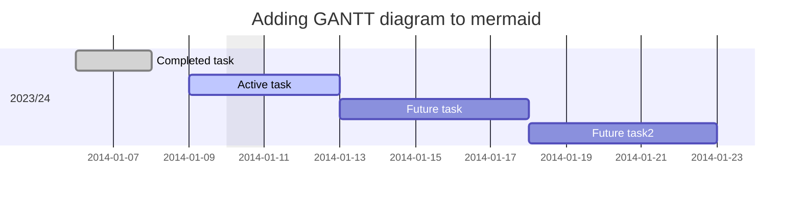

<!--
author:   

email:    

version:  0.0.1

language: Deutsch

narrator: Deutsch Female

comment:  

link:     https://cdn.jsdelivr.net/chartist.js/latest/chartist.min.css

script:   https://cdn.jsdelivr.net/chartist.js/latest/chartist.min.js

import:   https://raw.githubusercontent.com/liaScript/mermaid_template/master/README.md

translation: Deutsch  translations/German.md

translation: Français translations/French.md
-->

## Zielsetzung

| Jahr | 2024 | 2025 | 2026 |

## Planung Saison 23/24

