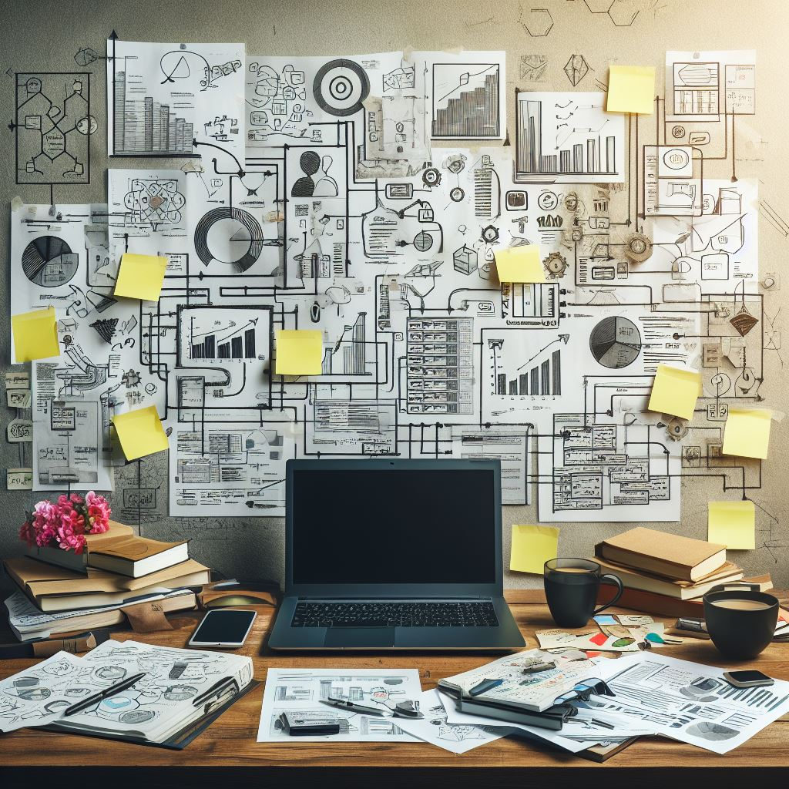

<!--
author:   
email:    
version:  0.1.0
language: Deutsch
narrator: Deutsch Female

comment: 

link:     https://cdn.jsdelivr.net/chartist.js/latest/chartist.min.css

script:   https://cdn.jsdelivr.net/chartist.js/latest/chartist.min.js

translation:
-->

# Zusammenbau eines PCs 

## Vorbereitung

Bevor Sie mit dem Zusammenbau eines PCs beginnen, gibt es einige wichtige Vorbereitungen zu treffen:

- **Komponentenauswahl**: Zunächst müssen Sie entscheiden, welche Komponenten Sie für Ihren PC benötigen. Dazu gehören in der Regel ein Prozessor (CPU), ein Motherboard, Arbeitsspeicher (RAM), eine Festplatte (HDD) oder Solid-State-Drive (SSD), eine Grafikkarte (GPU), ein Netzteil (PSU) und ein Gehäuse.
- **Kompatibilität prüfen**: Stellen Sie sicher, dass alle Ihre Komponenten miteinander kompatibel sind. Das Motherboard muss zum Beispiel den richtigen Sockel für Ihre CPU haben und genug Steckplätze für Ihren RAM.
- **Arbeitsbereich vorbereiten**: Sie benötigen einen sauberen, gut beleuchteten Arbeitsbereich mit genügend Platz, um alle Ihre Komponenten auszubreiten.
- **Werkzeuge bereithalten**: Ein Kreuzschlitzschraubendreher ist in der Regel das wichtigste Werkzeug, das Sie benötigen, um einen PC zusammenzubauen. Darüber hinaus ist das Tragen eines antistatische Armband, um zu verhindern, dass statische Elektrizität Ihre Komponenten beschädigt, sinnvoll.
- **Anleitungen lesen**: Es ist immer eine gute Idee, die mit Ihren Komponenten gelieferten Anleitungen zu lesen, bevor Sie mit dem Zusammenbau beginnen. Diese enthalten oft hilfreiche Diagramme und spezifische Anweisungen für den Einbau.

### Arbeitsplatz

Ein gut organisierter Arbeitsbereich ist entscheidend für den erfolgreichen Zusammenbau eines Personal Computers. Hier sind einige Tipps, wie Sie Ihren Arbeitsbereich gestalten können:

- **Sauber und ordentlich**: Stellen Sie sicher, dass Ihr Arbeitsbereich sauber und frei von Staub und Schmutz ist.
- **Ausreichend Platz**: Sie benötigen genügend Platz, um alle Ihre Komponenten auszubreiten und zu arbeiten.
- **Gute Beleuchtung**: Eine gute Beleuchtung ist wichtig, um sicherzustellen, dass Sie alle Komponenten und Anschlüsse klar sehen können.
- **Antistatische Maßnahmen**: Verwenden Sie eine antistatische Matte oder ein Armband, um statische Elektrizität zu vermeiden, die Ihre PC-Komponenten beschädigen könnte.
- **Werkzeuge**: Stellen Sie sicher, dass Sie die richtigen Werkzeuge zur Hand haben, wie z.B. einen Kreuzschlitzschraubendreher.
- **Komponenten organisieren**: Legen Sie Ihre Komponenten in der Reihenfolge aus, in der Sie sie installieren möchten, um den Prozess zu vereinfachen.
- **Handbücher**: Halten Sie die Handbücher Ihrer Komponenten griffbereit für den Fall, dass Sie während des Zusammenbaus auf Probleme stoßen.
- **Ruhe bewahren**: Nehmen Sie sich Zeit und haben Sie Geduld. Der Zusammenbau eines PCs kann eine Weile dauern, besonders wenn es das erste Mal ist.

### Werkzeuge

Beim Zusammenbau eines Personal Computers werden folgende Werkzeuge empfohlen [^1][^2]:

- **Schraubendreher und Steckschlüssel**: Für die meisten einfachen PC-Arbeiten benötigen Sie nur einen einzigen Kreuzschlitz-Schraubendreher. Sobald Sie aber damit anfangen im Inneren des Rechners Komponenten auszutauschen, benötigen Sie unterschiedliche Schraubendreher und Steckschlüssel.
- **Akkuschrauber**: Falls Sie häufig Geräte aufbauen und aufrüsten, macht es Sinn in einen Akkuschrauber zu investieren.
- **Zangen, Cutter und Abisolierzangen**: Diese können verwendet werden, um ungenutzte Teile oder Stecker im Inneren des Gehäuses zu entfernen.
- **Arterienklemme**: Manchmal ist es nötig, besonders kleine Teile im PC-Inneren möglichst fest zu halten. Dafür eignet sich eine Arterienklemme perfekt.

[^1]: Das nötige Werkzeug für PC-Bastler - PC-WELT. https://www.pcwelt.de/article/1147062/das_noetige_werkzeug_fuer_pc-bastler-elektronik.html.
[^2]: Die besten Werkzeuge für PC-Bastler - PC-WELT. https://www.pcwelt.de/article/1134487/eigenbau-die_besten_werkzeuge_fuer_pc-bastler.html.

## Generelle Arbeitsschritte

Der Zusammenbau eines Personal Computers kann in mehrere Schritte unterteilt werden. Hier ist eine allgemeine Anleitung[^3][^4]:

1. **Gehäusevorbereitung**: Öffnen Sie das Gehäuse und bereiten Sie es für den Einbau der Komponenten vor.
2. **Installieren des CPU in den Sockel**: Platzieren Sie den Prozessor vorsichtig in den Sockel auf dem Mainboard.
3. **Installieren des Kühlers auf den Prozessor**: Befestigen Sie den Kühler auf dem Prozessor. Stellen Sie sicher, dass die Wärmeleitpaste korrekt aufgetragen wird⁷.
4. **Den Arbeitsspeicher mit dem Motherboard verbinden**: Stecken Sie die RAM-Module in die dafür vorgesehenen Steckplätze auf dem Mainboard.
5. **Das Mainboard vorbereiten und platzieren**: Platzieren Sie das Mainboard im Gehäuse und schrauben Sie es fest.
6. **Grafikkarte installieren**: Stecken Sie die Grafikkarte in den entsprechenden Steckplatz auf dem Mainboard.
7. **SSD/HDD Disk verbinden**: Verbinden Sie Ihre Festplatte oder SSD mit dem Mainboard und der Stromversorgung.
8. **Anschließen der Stromversorgung an das Motherboard**: Schließen Sie das Netzteil an das Mainboard und alle anderen Komponenten an, die Strom benötigen.
9. **Wiederverschließen des Gehäuse**: Verschließen Sie das Computergehäuse.
 
Bitte beachten Sie, dass dies allgemeine Arbeitsschrittes sind die je nach Ihren spezifischen Komponenten variieren könne. Es ist immer ratsam, die mit Ihren Komponenten gelieferten Handbücher zu konsultieren.

[^3]: PC BAUEN für ANFÄNGER - Ultimative Schritt für Schritt Anleitung. https://www.youtube.com/watch?v=cqEegGsjrYI.
[^4]: PC selber zusammenbauen – Schritt für Schritt - Tuhl Teim DE. https://tuhlteim.de/pc-zusammenbauen-schritt-fuer-schritt-eigenen-rechner-bauen-anleitung-video.

### Gehäusevorbereitung

Öffnen Sie das Gehäuse und bereiten Sie es für den Einbau der Komponenten vor. Dazu müssen Sie möglicherweise einige Schrauben lösen oder Klammern öffnen, um die Seitenwände zu entfernen. Bewahren Sie die Schrauben in einer Schale oder einem Beutel auf, damit Sie sie nicht verlieren. 

Entfernen Sie auch alle Zubehörteile wie Laufwerksschienen oder Kabel, die im Gehäuse enthalten sind. 

Legen Sie das Gehäuse auf eine ebene Fläche und suchen Sie nach den vormontierten Abstandshaltern für das Mainboard. Diese sind kleine Metallstifte, die aus dem Gehäuseboden herausragen und verhindern, dass das Mainboard einen Kurzschluss verursacht. 

Stellen Sie sicher, dass die Anzahl und Anordnung der Abstandshalter mit den Löchern auf Ihrem Mainboard übereinstimmt. Wenn nicht, müssen Sie einige Abstandshalter hinzufügen oder entfernen[^5].

[^5]: How to build a PC, the last guide you'll ever need!. https://www.youtube.com/watch?v=BL4DCEp7blY.

### Installieren des CPU in den Sockel 

Platzieren Sie den Prozessor vorsichtig in den Sockel auf dem Mainboard. Achten Sie darauf, dass Sie den Prozessor nicht an den Pins berühren oder diese verbiegen. Orientieren Sie sich an der Markierung auf dem Prozessor und dem Sockel, um die richtige Ausrichtung zu finden. 

Drücken Sie den Prozessor nicht in den Sockel, sondern lassen Sie ihn sanft einrasten. Schließen Sie dann den Verriegelungsmechanismus des Sockels, um den Prozessor zu sichern[^6].

[^6]: How To Build A PC - Step by Step (Full Build Guide). https://www.youtube.com/watch?v=PXaLc9AYIcg.

### Installieren des Kühlers auf den Prozessor 

Befestigen Sie den Kühler auf dem Prozessor. Stellen Sie sicher, dass die Wärmeleitpaste korrekt aufgetragen wird. Die Wärmeleitpaste ist eine Substanz, die die Wärmeübertragung zwischen dem Prozessor und dem Kühler verbessert. 

Einige Kühler haben bereits eine dünne Schicht Wärmeleitpaste auf der Unterseite aufgetragen, andere erfordern, dass Sie sie selbst auftragen. Wenn Sie Ihre eigene Wärmeleitpaste verwenden müssen, tragen Sie eine kleine Menge (etwa die Größe eines Reiskorns) in der Mitte des Prozessors auf. 

Drücken Sie dann den Kühler auf den Prozessor und befestigen Sie ihn mit den mitgelieferten Schrauben oder Klammern am Mainboard. Schließen Sie auch das Lüfterkabel des Kühlers an den entsprechenden Anschluss auf dem Mainboard an[^6].

[^6]: How To Build A PC - Step by Step (Full Build Guide). https://www.youtube.com/watch?v=PXaLc9AYIcg.

### Den Arbeitsspeicher mit dem Motherboard verbinden 

Stecken Sie die RAM-Module in die dafür vorgesehenen Steckplätze auf dem Mainboard. Achten Sie darauf, dass die Kerben auf den Modulen mit den Kerben in den Steckplätzen übereinstimmen. Drücken Sie die Module fest nach unten, bis sie einrasten und die seitlichen Halteklammern sie sichern. 

Wenn Ihr Mainboard mehr als zwei Steckplätze hat, beachten Sie die Farbcodierung oder die Beschriftung auf dem Mainboard, um zu wissen, welche Steckplätze zuerst belegt werden sollen[^7].

[^7]: How to Build a Gaming PC in 2021 - Easy 10-minute Build Guide!. https://www.youtube.com/watch?v=sLWXvNbJMpw.

### Das Mainboard vorbereiten und platzieren

Platzieren Sie das Mainboard im Gehäuse und schrauben Sie es fest. Bevor Sie das tun, müssen Sie möglicherweise das E/A-Blendenblech installieren, das die Anschlüsse auf der Rückseite des Mainboards abdeckt. Dieses Blech wird normalerweise mit dem Mainboard geliefert und muss von innen in die Aussparung an der Rückseite des Gehäuses eingesetzt werden. 

Dann können Sie das Mainboard vorsichtig in das Gehäuse einsetzen und darauf achten, dass die Anschlüsse durch das Blech passen und die Löcher auf dem Mainboard mit den Abstandshaltern im Gehäuse ausgerichtet sind. 

Befestigen Sie dann das Mainboard mit den passenden Schrauben am Gehäuse[^5] .

[^5]: How to build a PC, the last guide you'll ever need!. https://www.youtube.com/watch?v=BL4DCEp7blY.

### Grafikkarte installieren

Stecken Sie die Grafikkarte in den entsprechenden Steckplatz auf dem Mainboard. Dies ist normalerweise der längste und oberste Steckplatz, der als PCI Express x16 bezeichnet wird. 

Um Platz für die Grafikkarte zu schaffen, müssen Sie möglicherweise eine oder mehrere Metallblenden an der Rückseite des Gehäuses entfernen. Diese sind normalerweise mit Schrauben oder Klammern befestigt und können leicht herausgebrochen werden. 

Schieben Sie dann die Grafikkarte in den Steckplatz, bis sie einrastet und sichern Sie sie mit einer Schraube am Gehäuse. 

Wenn Ihre Grafikkarte einen zusätzlichen Stromanschluss benötigt, verbinden Sie ihn mit einem passenden Kabel von Ihrem Netzteil[^6].

[^6]: How To Build A PC - Step by Step (Full Build Guide). https://www.youtube.com/watch?v=PXaLc9AYIcg.

### SSD/HDD Disk verbinden

Verbinden Sie Ihre Festplatte oder SSD mit dem Mainboard und der Stromversorgung. 

Je nach Formfaktor Ihrer Festplatte oder SSD müssen Sie sie möglicherweise in einen Laufwerksschacht oder einen speziellen Halter im Gehäuse einbauen. 

Befolgen Sie dazu die Anweisungen Ihres Gehäuses und Ihrer Festplatte oder SSD[^5]. 

Verwenden Sie dann ein SATA-Kabel, um Ihre Festplatte oder SSD mit einem SATA-Anschluss auf dem Mainboard zu verbinden⁵. 

Schließen Sie auch ein Stromkabel von Ihrem Netzteil an Ihre Festplatte oder SSD an[^6].

[^5]: How to build a PC, the last guide you'll ever need!. https://www.youtube.com/watch?v=BL4DCEp7blY.
[^6]: How To Build A PC - Step by Step (Full Build Guide). https://www.youtube.com/watch?v=PXaLc9AYIcg.

### Anschließen der Stromversorgung an das Motherboard

Schließen Sie das Netzteil an das Mainboard und alle anderen Komponenten an, die Strom benötigen. Das Netzteil wird normalerweise am Boden oder an der Oberseite des Gehäuses montiert und hat mehrere Kabel, die aus ihm herauskommen[^5]. 

Das wichtigste Kabel ist das 24-polige ATX-Kabel, das an den größten Anschluss auf dem Mainboard angeschlossen wird. 
Ein weiteres wichtiges Kabel ist das 4- oder 8-polige EPS-Kabel, das an den Anschluss in der Nähe des Prozessors auf dem Mainboard angeschlossen wird. Diese beiden Kabel versorgen das Mainboard und den Prozessor mit Strom[^6]. 

Andere Kabel, die Sie möglicherweise anschließen müssen, sind[^6]: 
- PCI Express-Kabel für die Grafikkarte (falls erforderlich) 
- SATA-Stromkabel für die Festplatte oder SSD - Molex- oder SATA-Stromkabel für die Lüfter (falls nicht direkt am Mainboard angeschlossen) 
- Molex- oder SATA-Stromkabel für andere Geräte wie optische Laufwerke oder LED-Beleuchtung.

[^5]: How to build a PC, the last guide you'll ever need!. https://www.youtube.com/watch?v=BL4DCEp7blY.
[^6]: How To Build A PC - Step by Step (Full Build Guide). https://www.youtube.com/watch?v=PXaLc9AYIcg.

### Wiederverschließen des Gehäuse

Hier sind einige allgemeine Tipps, wie Sie ein Computergehäuse verschließen können[^8]:

- Wenn das Gehäuse aus einem Stück besteht, müssen Sie es in Richtung der Rückseite schieben, bis es einrastet. Manchmal müssen Sie etwas Kraft anwenden oder mit der flachen Hand auf das Gehäuse schlagen, um es zu lösen oder zu befestigen.
- Wenn das Gehäuse aus zwei oder mehr Teilen besteht, müssen Sie die Seiten einzeln abnehmen oder anbringen. Achten Sie darauf, dass die Teile richtig ausgerichtet sind und keine Kabel einklemmen. Schrauben Sie die Teile fest oder verwenden Sie die vorgesehenen Klammern oder Haken, um sie zu sichern.
- Wenn das Gehäuse über ein Zahlenschloss verfügt, müssen Sie es nach dem Verschließen einstellen. Dazu müssen Sie einen kleinen Hebel, Schieber, Klappe oder Stift am Zahlenschloss betätigen und die gewünschte Zahlenkombination eingeben. Vergessen Sie nicht, den Hebel, Schieber, Klappe oder Stift wieder in die ursprüngliche Position zu bringen, um das Schloss zu aktivieren.

[^8]: Gehäuse: Öffnen Sie das Gehäuse - PC-WELT. https://www.pcwelt.de/article/1128231/gehaeuse-oeffnen-sie-das-gehaeuse.html.

## Nachbereitung

Nachdem Sie einen PC zusammengebaut haben, gibt es einige Dinge, die Sie tun sollten, um sicherzustellen, dass er ordnungsgemäß funktioniert. Hier sind einige Schritte, die Sie befolgen können:

1. Überprüfen Sie, ob alle Kabel richtig angeschlossen sind und ob keine losen oder beschädigten Teile vorhanden sind.
2. Schalten Sie den PC ein und prüfen Sie, ob alle Lüfter, LEDs und Laufwerke funktionieren.
3. Rufen Sie das BIOS auf und überprüfen Sie die Einstellungen. Sie können auch die Temperatur und die Spannung Ihrer Hardware überwachen.
4. Laden Sie das Betriebssystem und aktualisieren Sie die Treiber für Ihre Hardware. Führen Sie auch die Windows-Aktivierung durch.
5. Scannen Sie die Systemdateien von Windows auf Fehler, indem Sie die Eingabeaufforderung als Administrator ausführen und den Befehl `sfc /SCANNOW` eingeben.
6. Testen Sie die Leistung und die Kompatibilität Ihrer Hardware mit verschiedenen Tools, wie zum Beispiel CPU-Z, FurMark, MemTest oder Check Drive 2019. Diese Tools messen die Leistung Ihres Prozessors, Ihrer Grafikkarte, Ihres Arbeitsspeichers und Ihrer Festplatte und zeigen Ihnen mögliche Fehler oder Schwachstellen an.

## Lernkarten

Hier geht es zu den [Lernkarten](https://app.mochi.cards/decks/67233147-73f4-462a-984f-207550c6f793/jWlG4aRL/ZusammenbaueinesPCs).

Zum Lernen der Karten wählen Sie auf der Webseite oben rechts unter New cards den Menüpunkt `Cram` aus.

Um eine Karteikarte umzublättern klicken Sie diese einfach an.

Mit Hilfe der Rückseite überprüfen Sie, ob Sie die Antwort gewusst oder nicht gewusst haben.

- Mit der `Space` Taste zeigen Sie an, dass Sie die Antwort wussten.
- Mit der `R` Taste zeigen Sie an, dass Sie diese noch nicht wussten.

## Kompetenzcheck

**1. Welche Bedingungen sollte ein Arbeitsplatz für die PC-Montage erfüllen?**

<!-- data-randomize 
     data-solution-button="off"
     data-max-trials="3" 
-->
    [[x]] Sauber und ordentlich
    [[x]] Ausreichend Platz
    [[x]] Gute Beleuchtung
    [[x]] Antistatische Maßnahmen
    [[ ]] Lärmschutz
    [[ ]] Reinraum

**2. Ordnen Sie die folgenden allgemeinen Schritte zum Zusammenbau des PCs chronologisch!**

<!-- 
    data-randomize 
    data-solution-button="off"
    data-max-trials="3" 
-->
| Schritt | Beschreibung                  |
| ------------- | ------------------------ |
| 1. | [[ (Gehäusevorbereitung) | Installieren des CPU in den Sockel | Installieren des Kühlers auf den Prozessor | Den Arbeitsspeicher mit dem Motherboard verbinden | Das Mainboard vorbereiten und platzieren | Grafikkarte installieren | SSD/HDD Disk verbinden | Anschließen der Stromversorgung an das Motherboard | Wiederverschließen des Gehäuse ]] |
| 2. | [[  Gehäusevorbereitung | (Installieren des CPU in den Sockel) | Installieren des Kühlers auf den Prozessor | Den Arbeitsspeicher mit dem Motherboard verbinden | Das Mainboard vorbereiten und platzieren | Grafikkarte installieren | SSD/HDD Disk verbinden | Anschließen der Stromversorgung an das Motherboard | Wiederverschließen des Gehäuse ]] |
| 3. | [[  Gehäusevorbereitung | Installieren des CPU in den Sockel | (Installieren des Kühlers auf den Prozessor) | Den Arbeitsspeicher mit dem Motherboard verbinden | Das Mainboard vorbereiten und platzieren | Grafikkarte installieren | SSD/HDD Disk verbinden | Anschließen der Stromversorgung an das Motherboard | Wiederverschließen des Gehäuse ]] |
| 4. | [[  Gehäusevorbereitung | Installieren des CPU in den Sockel | Installieren des Kühlers auf den Prozessor | (Den Arbeitsspeicher mit dem Motherboard verbinden) | Das Mainboard vorbereiten und platzieren | Grafikkarte installieren | SSD/HDD Disk verbinden | Anschließen der Stromversorgung an das Motherboard | Wiederverschließen des Gehäuse ]] |
| 5. | [[ Gehäusevorbereitung | Installieren des CPU in den Sockel | Installieren des Kühlers auf den Prozessor | Den Arbeitsspeicher mit dem Motherboard verbinden | (Das Mainboard vorbereiten und platzieren) | Grafikkarte installieren | SSD/HDD Disk verbinden | Anschließen der Stromversorgung an das Motherboard | Wiederverschließen des Gehäuse ]] |
| 6. | [[  Gehäusevorbereitung | Installieren des CPU in den Sockel | Installieren des Kühlers auf den Prozessor | Den Arbeitsspeicher mit dem Motherboard verbinden | Das Mainboard vorbereiten und platzieren | (Grafikkarte installieren) | SSD/HDD Disk verbinden | Anschließen der Stromversorgung an das Motherboard | Wiederverschließen des Gehäuse ]] |
| 7. | [[  Gehäusevorbereitung | Installieren des CPU in den Sockel | Installieren des Kühlers auf den Prozessor | Den Arbeitsspeicher mit dem Motherboard verbinden | Das Mainboard vorbereiten und platzieren | Grafikkarte installieren | (SSD/HDD Disk verbinden) | Anschließen der Stromversorgung an das Motherboard | Wiederverschließen des Gehäuse ]] |
| 8. | [[  Gehäusevorbereitung | Installieren des CPU in den Sockel | Installieren des Kühlers auf den Prozessor | Den Arbeitsspeicher mit dem Motherboard verbinden | Das Mainboard vorbereiten und platzieren | Grafikkarte installieren | SSD/HDD Disk verbinden | (Anschließen der Stromversorgung an das Motherboard) | Wiederverschließen des Gehäuse ]] |
| 9. | [[  Gehäusevorbereitung | Installieren des CPU in den Sockel | Installieren des Kühlers auf den Prozessor | Den Arbeitsspeicher mit dem Motherboard verbinden | Das Mainboard vorbereiten und platzieren | Grafikkarte installieren | SSD/HDD Disk verbinden | Anschließen der Stromversorgung an das Motherboard | (Wiederverschließen des Gehäusen) ]] |

**3. Ordnen Sie die folgenden allgemeinen Nachbearbeitungsschritte chronologisch!**

<!-- 
    data-randomize 
    data-solution-button="off"
    data-max-trials="3" 
-->
| Schritt | Beschreibung                  |
| ------------- | ------------------------ |
| 1. | [[ Schalten Sie den PC ein und prüfen Sie, ob alle Lüfter, LEDs und Laufwerke funktionieren | Laden Sie das Betriebssystem und aktualisieren Sie die Treiber für Ihre Hardware | Testen Sie die Leistung und die Kompatibilität Ihrer Hardware mit verschiedenen Tools | (Überprüfen Sie, ob alle Kabel richtig angeschlossen sind) | Rufen Sie das BIOS auf und überprüfen Sie die Einstellungen | Scannen Sie die Systemdateien von Windows auf Fehler ]] |
| 2. | [[ (Schalten Sie den PC ein und prüfen Sie, ob alle Lüfter, LEDs und Laufwerke funktionieren) | Laden Sie das Betriebssystem und aktualisieren Sie die Treiber für Ihre Hardware | Testen Sie die Leistung und die Kompatibilität Ihrer Hardware mit verschiedenen Tools | Überprüfen Sie, ob alle Kabel richtig angeschlossen sind | Rufen Sie das BIOS auf und überprüfen Sie die Einstellungen | Scannen Sie die Systemdateien von Windows auf Fehler ]] |
| 3. | [[ Schalten Sie den PC ein und prüfen Sie, ob alle Lüfter, LEDs und Laufwerke funktionieren | Laden Sie das Betriebssystem und aktualisieren Sie die Treiber für Ihre Hardware | Testen Sie die Leistung und die Kompatibilität Ihrer Hardware mit verschiedenen Tools | Überprüfen Sie, ob alle Kabel richtig angeschlossen sind | (Rufen Sie das BIOS auf und überprüfen Sie die Einstellungen) | Scannen Sie die Systemdateien von Windows auf Fehler ]] |
| 4. | [[ Schalten Sie den PC ein und prüfen Sie, ob alle Lüfter, LEDs und Laufwerke funktionieren | (Laden Sie das Betriebssystem und aktualisieren Sie die Treiber für Ihre Hardware) | Testen Sie die Leistung und die Kompatibilität Ihrer Hardware mit verschiedenen Tools | Überprüfen Sie, ob alle Kabel richtig angeschlossen sind | Rufen Sie das BIOS auf und überprüfen Sie die Einstellungen | Scannen Sie die Systemdateien von Windows auf Fehler ]] |
| 5. | [[ Schalten Sie den PC ein und prüfen Sie, ob alle Lüfter, LEDs und Laufwerke funktionieren | Laden Sie das Betriebssystem und aktualisieren Sie die Treiber für Ihre Hardware | Testen Sie die Leistung und die Kompatibilität Ihrer Hardware mit verschiedenen Tools | Überprüfen Sie, ob alle Kabel richtig angeschlossen sind | Rufen Sie das BIOS auf und überprüfen Sie die Einstellungen | (Scannen Sie die Systemdateien von Windows auf Fehler) ]] |
| 6. | [[ Schalten Sie den PC ein und prüfen Sie, ob alle Lüfter, LEDs und Laufwerke funktionieren | Laden Sie das Betriebssystem und aktualisieren Sie die Treiber für Ihre Hardware | (Testen Sie die Leistung und die Kompatibilität Ihrer Hardware mit verschiedenen Tools) | Überprüfen Sie, ob alle Kabel richtig angeschlossen sind | Rufen Sie das BIOS auf und überprüfen Sie die Einstellungen | Scannen Sie die Systemdateien von Windows auf Fehler ]] |

## Offene Aufgabe

**Erstellen Sie in Gruppenarbeit Ihre eigene Anleitung zum Zusammenbau eines Arbeitsplatz Computers und präsentieren Sie diese untereinander.**

[[___ ___ ___ ___]]